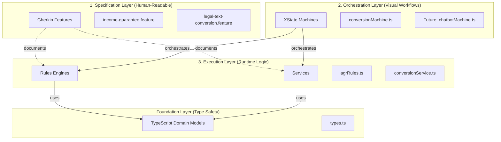
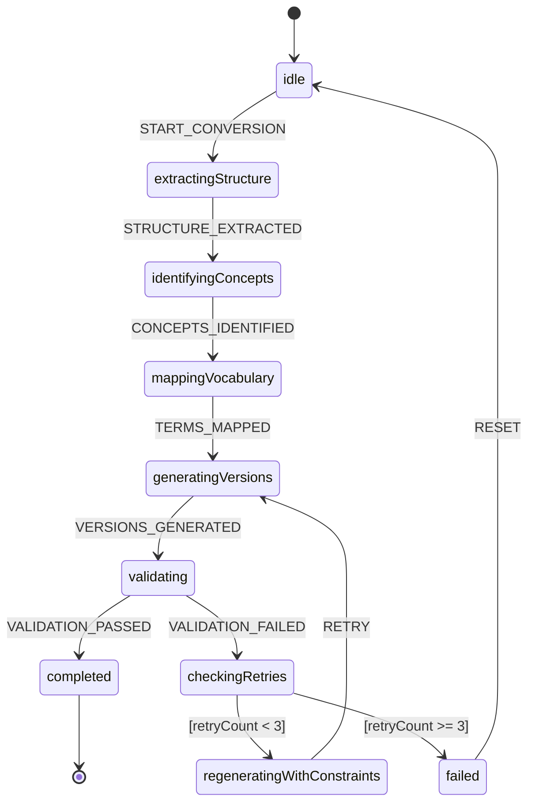
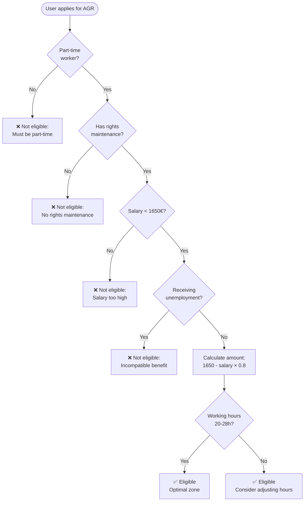
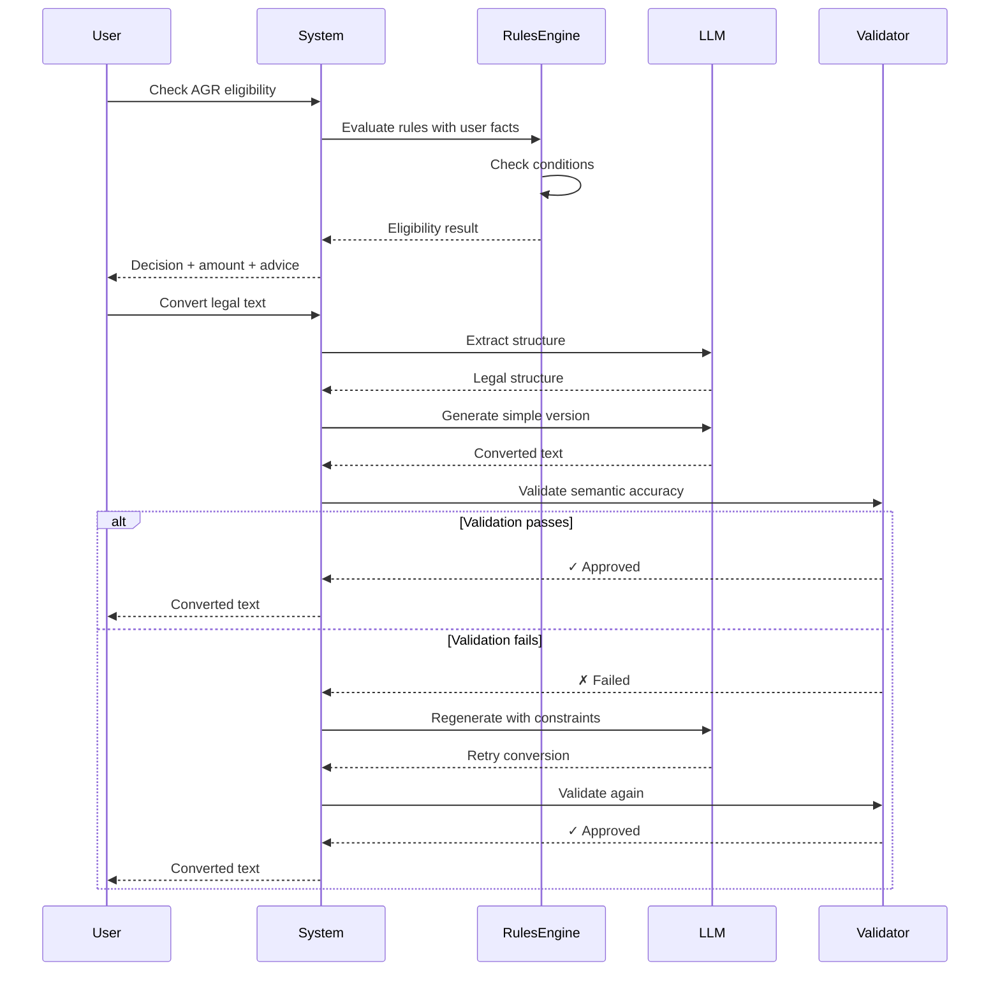

# Architecture Overview

## 🎯 The Three-Layer Architecture

This POC demonstrates a **three-layer separation of concerns**:



## 🔄 Legal Text Conversion Workflow



## 💰 AGR Eligibility Decision Flow



## 📦 Data Flow



## 🎯 Why This Architecture Works for Belgian Social Law

### Challenge 1: Complex, Changing Rules
**Solution:** Gherkin specifications + Rules Engine
- Rules are documented in plain language
- Can be updated without code deployment
- Versioned with effective dates
- Validated by legal experts

### Challenge 2: Multi-Step Processes
**Solution:** XState workflows
- Clear visualization of process
- Built-in retry logic
- Auditable state transitions
- No hidden states or race conditions

### Challenge 3: Type Safety for Money/Dates
**Solution:** TypeScript with strong typing
- Compile-time checks
- No mixing of types (EUR vs hours)
- IDE autocomplete
- Refactoring safety

### Challenge 4: Human-in-the-Loop Validation
**Solution:** State machine with validation states
- Can pause for human review
- Track who validated what
- Retry mechanism for corrections
- Audit trail

## 🔮 Extending the Architecture

### Adding New Benefits (e.g., RIS)

1. **Specification**
   ```gherkin
   # features/benefits/ris.feature
   Fonctionnalité: Revenu d'Intégration Sociale
   ```

2. **Rules**
   ```typescript
   // src/rules/risRules.ts
   export function createRISEngine(): Engine
   ```

3. **Types**
   ```typescript
   // src/domain/types.ts
   export type BenefitType = 'agr' | 'ris' | ...
   ```

### Adding New Workflows (e.g., WhatsApp Bot)

```typescript
// src/workflows/chatbotMachine.ts
export const chatbotMachine = createMachine({
  id: 'whatsappBot',
  initial: 'greeting',
  states: {
    greeting: { /* ... */ },
    identifyingProblem: { /* ... */ },
    collectingInfo: { /* ... */ },
    calculating: { /* ... */ },
    responding: { /* ... */ }
  }
});
```

### Adding Multi-Language Support

```typescript
// src/domain/types.ts
export type Language = 'fr' | 'nl' | 'de';

// src/rules/i18n.ts
export const translations = {
  fr: { 'agr-eligible': 'Éligible pour AGR' },
  nl: { 'agr-eligible': 'In aanmerking voor AGR' },
  de: { 'agr-eligible': 'Berechtigt für AGR' }
};
```

## 📊 Comparison: Before vs After

### Before (Traditional Approach)
```typescript
// Hard to read, hard to change
function checkEligibility(user) {
  if (user.status === 'PT' && user.rm === true && user.sal < 1650 && !user.unemp) {
    return 1650 - user.sal * 0.8;
  }
  return 0;
}
```
Problems:
- ❌ Cryptic variable names
- ❌ Magic numbers
- ❌ No documentation of why
- ❌ Hard to test edge cases
- ❌ Can't validate with legal experts

### After (This Architecture)
```gherkin
# Human-readable specification
Scénario: Travailleur à temps partiel avec maintien des droits éligible
  Étant donné que je suis un travailleur à temps partiel
  Et que j'ai le maintien des droits
  Et que mon salaire brut mensuel est de 1200€
  Quand je vérifie mon éligibilité à l'AGR
  Alors je devrais être éligible
  Et le montant de l'allocation devrait être 360€
```

Benefits:
- ✅ Legal experts can read and validate
- ✅ Clear intent and reasoning
- ✅ Becomes automated test
- ✅ Versioned in git
- ✅ Self-documenting

## 🎓 Architecture Principles

### 1. **Separation of Concerns**
- Specification ≠ Implementation
- Workflows ≠ Business Rules
- Types ≠ Runtime Logic

### 2. **Single Source of Truth**
- Gherkin features are the spec
- Code implements the spec
- Tests validate the spec

### 3. **Fail Fast, Fail Safe**
- TypeScript catches errors at compile time
- Rules engine catches logic errors at runtime
- Validation catches semantic errors before delivery

### 4. **Audit-First Design**
- State machines track every transition
- Rules engine tracks which rules fired
- All decisions are traceable

### 5. **Human-First**
- Non-developers can read specifications
- Visual workflows aid understanding
- Examples demonstrate behavior

---

## 📚 Further Reading

- **Domain-Driven Design:** Eric Evans
- **State Machines:** David Harel
- **Business Rules Engines:** Martin Fowler
- **Behavior-Driven Development:** Dan North

This architecture balances:
- **Readability** (for legal experts)
- **Maintainability** (for developers)
- **Flexibility** (for changing regulations)
- **Safety** (for critical calculations)
