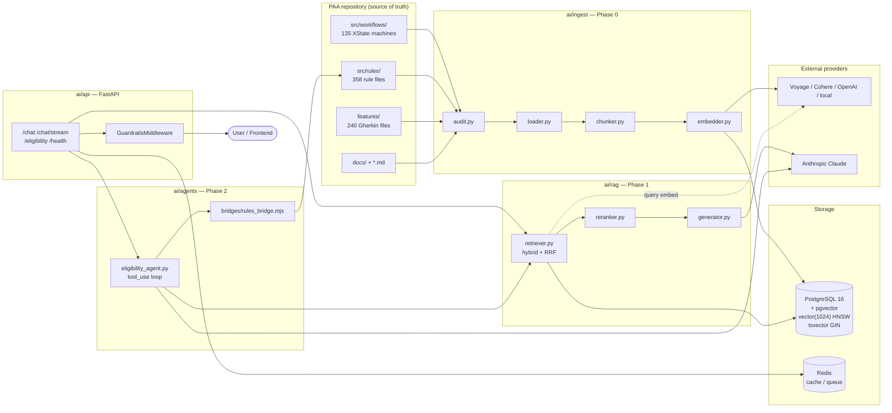
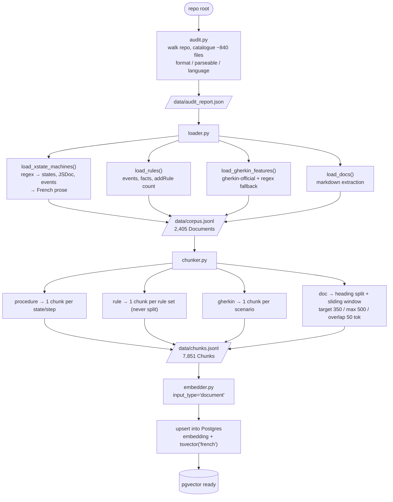
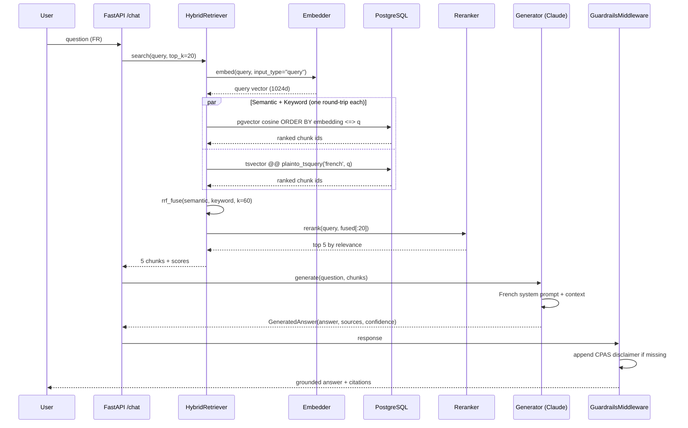
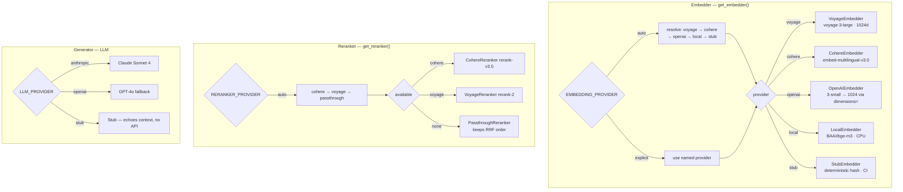
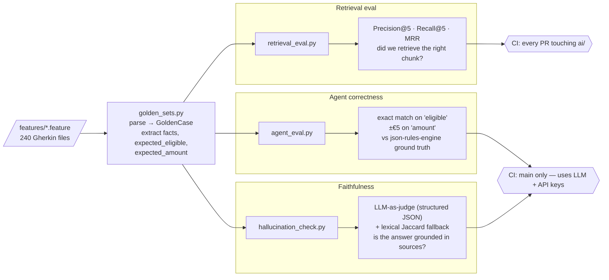
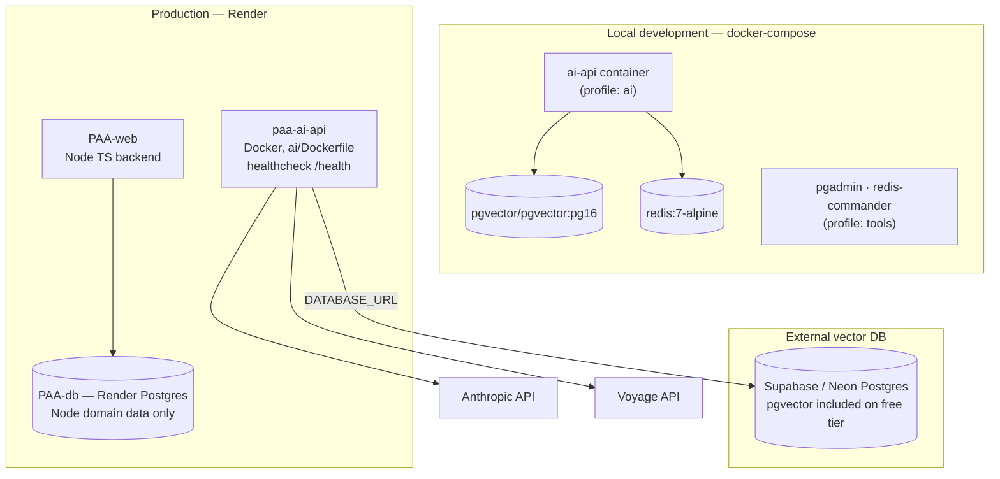

# PAA AI Layer — Architecture & Technical Flow

This document describes the architecture of the PAA AI layer: a RAG-based
question-answering and agentic eligibility system built in Python on top of the
existing TypeScript PAA core (XState procedures + json-rules-engine).

The guiding principle: **the LLM handles language; deterministic code handles
truth.** Retrieval is grounded in the real corpus, and every eligibility number
comes from the json-rules-engine — never from the model.

---

## 1. System Architecture

All components and how they connect, from the PAA repo on the left to the
user-facing API on the right.



**Key boundaries**

- The **ingest pipeline** is offline/batch. It reads the repo, never the live API.
- **Storage** is the only stateful component. Postgres holds chunks + embeddings;
  Redis is optional cache.
- The **agent** never computes eligibility itself — it shells out to
  `rules_bridge.mjs`, which runs the *real* json-rules-engine.

---

## 2. Ingest Pipeline (Phase 0)

Turns 133+ heterogeneous procedure sources into embedded, searchable chunks.



**Why chunk by structure, not by token count?** A rule set is meaningless when
split — eligibility logic only makes sense whole. A procedure step is a natural
retrieval unit. Only free-form docs get the generic sliding-window treatment.

The `Document` → `Chunk` schema (`ingest/normaliser.py`):

```
Document(id="procedure:ris", source_type, title, content, metadata, language, source_path)
Chunk(id="procedure:ris#step-2", document_id, source_type, ..., position)
```

---

## 3. RAG Query Flow (Phase 1)

A grounded question-answer with hybrid retrieval and reranking.



**Reciprocal Rank Fusion** combines the two rankings without needing comparable
scores: `score(d) = Σ 1 / (k + rank_i(d))`, `k=60`. A chunk ranked high by
*either* method surfaces; a chunk ranked high by *both* dominates.

**Asymmetric retrieval matters.** Documents are embedded with
`input_type="document"` at ingest; queries with `input_type="query"` at search.
Voyage, Cohere, and e5-style models project these into aligned-but-distinct
spaces — mixing them silently degrades recall.

---

## 4. Agentic Eligibility Flow (Phase 2)

A multi-turn agent gathers facts conversationally, then delegates the actual
eligibility decision to the deterministic rules engine.

```mermaid
flowchart TD
    START([User: "Suis-je éligible au RIS ?"]) --> LOOP{tool_use loop<br/>max 8 turns}

    LOOP -->|Claude decides| T1["search_procedures<br/>→ HybridRetriever"]
    LOOP -->|Claude decides| T2["get_procedure_steps"]
    LOOP -->|Claude decides| T3["get_required_documents"]
    LOOP -->|Claude decides| T4["check_eligibility"]

    T1 --> FEED[tool_result back to Claude]
    T2 --> FEED
    T3 --> FEED

    T4 --> BRIDGE["rules_engine.py<br/>subprocess"]
    BRIDGE --> NODE["node bridges/rules_bridge.mjs<br/>loads dist/rules/*"]
    NODE --> JRE["json-rules-engine<br/>DETERMINISTIC evaluation"]
    JRE --> RESULT["EligibilityResult<br/>{eligible, amount, reasons}"]
    RESULT --> FEED

    FEED --> LOOP
    LOOP -->|no more tool calls| ANSWER([Final answer:<br/>conversational + exact numbers])

    NODE -.Node/bridge missing.-> UNAVAIL["unavailable=True<br/>agent says so honestly"]
    UNAVAIL --> FEED
```

**The responsibility split is absolute:**

| Concern | Owner | Why |
|---|---|---|
| Conversation, intent, follow-up questions | Claude (LLM) | Natural language is its strength |
| Which procedure applies | Retrieval (grounded) | Must be in the real corpus |
| Is the user eligible? How much? | json-rules-engine (Node) | Auditable, versioned, legally exact |

The LLM **never** produces a euro amount. If the Node bridge is unavailable, the
result carries `unavailable=True` and the agent says it cannot compute the
figure — it does not guess.

---

## 5. Provider Pluggability

Embedder, reranker, and LLM are all swappable behind a small factory. Selection
is resolved once in `config.py`.



**Everything settles on 1024 dimensions** so the `vector(1024)` Postgres column
never needs migration: native for Voyage / Cohere / BGE-M3, truncated for OpenAI
via the `dimensions=` API parameter.

**Stub everywhere** means the whole pipeline — ingest, retrieval, eval — runs in
CI with zero API keys and zero network. Quality metrics are meaningless in stub
mode, but the pipeline *shape* and failure modes are fully exercised.

---

## 6. Evaluation Framework (Phase 3)

The existing Gherkin scenarios are the golden set — they already encode the
correct answers, validated by domain experts.



**Eval tiers map to CI cost:**

- **Retrieval eval** runs on every PR — offline, stub embedder, real Postgres.
  No API keys, so it is free and deterministic.
- **Agent eval + faithfulness** run on `main` only — they make real LLM calls
  and need secrets. Gated behind `github.ref == 'refs/heads/main'`.

---

## 7. Deployment Topology



**Why an external Postgres for the AI service?** Render's free Postgres does
**not** ship the `pgvector` extension. Supabase and Neon both include it on
their free tiers, so `DATABASE_URL` for `paa-ai-api` points there. Local Docker
uses the `pgvector/pgvector:pg16` image and works unchanged — the only
difference is the connection string.

---

## Component Reference

| Module | Responsibility | Phase |
|---|---|---|
| `ingest/audit.py` | Catalogue repo files (stdlib only) | 0 |
| `ingest/loader.py` | Source files → `corpus.jsonl` Documents | 0 |
| `ingest/chunker.py` | Documents → `chunks.jsonl` Chunks | 0 |
| `ingest/embedder.py` | Chunks → vectors, upsert to Postgres | 0 |
| `rag/retriever.py` | Hybrid search (pgvector + tsvector) + RRF | 1 |
| `rag/reranker.py` | Cross-encoder rerank, passthrough fallback | 1 |
| `rag/generator.py` | Grounded answer generation (Claude) | 1 |
| `agents/eligibility_agent.py` | Multi-turn `tool_use` loop | 2 |
| `agents/tools/rules_engine.py` | Subprocess bridge to json-rules-engine | 2 |
| `bridges/rules_bridge.mjs` | Node ESM — runs the real rules engine | 2 |
| `eval/golden_sets.py` | Gherkin → `GoldenCase` golden data | 3 |
| `eval/retrieval_eval.py` | Precision@k, Recall@k, MRR | 3 |
| `eval/agent_eval.py` | Agent output vs rules-engine ground truth | 3 |
| `eval/hallucination_check.py` | Faithfulness — LLM judge + lexical | 3 |
| `api/main.py` | FastAPI app, routes, guardrails | 1+ |
| `config.py` | Settings + provider resolution | all |

See [`README.md`](./README.md) for setup and [`../README.md`](../README.md)
for the full project roadmap.
