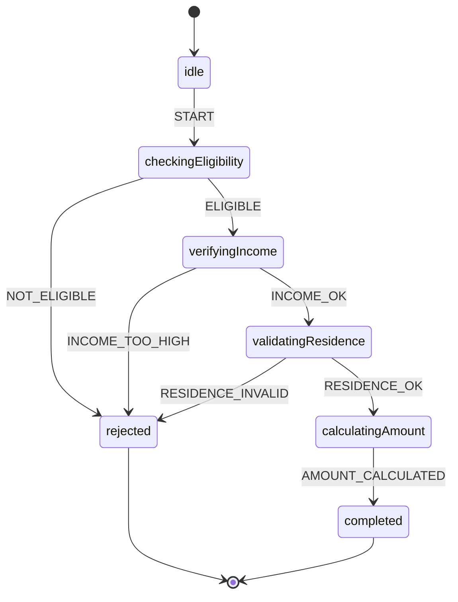

# UX/UI Design Brief: PAA Documentation Platform Enhancement

**Project:** Plateforme d'Aide Administrative (PAA) Documentation
**Platform:** Astro Static Site (docs-astro/)
**Current State:** 109 state machines, 24 categories, interactive visualization
**Date:** 2025-11-17
**Version:** 1.1

---

## 📘 Project Context: Understanding PAA

**If you're new to this project, start here. This section explains everything you need to know to understand the design challenge.**

### What is PAA?

**PAA (Plateforme d'Aide Administrative)** is a Belgian government platform designed to help citizens navigate complex social benefits and administrative processes. Think of it as a "TurboTax for Belgian social welfare" - it helps people understand what benefits they qualify for and guides them through the application process.

### The Problem Being Solved

Belgium has a sophisticated but incredibly complex social welfare system. Citizens need to navigate dozens of different benefits programs, each with its own eligibility rules, application processes, and legal requirements:

**Examples of Belgian Social Benefits:**
- **AGR (Allocation de Garantie de Revenus)** - Income guarantee for part-time workers
- **RIS (Revenu d'Intégration Sociale)** - Social integration income for people without resources
- **Unemployment benefits** - Financial support for job seekers
- **Family allowances** - Child support payments
- **Housing assistance** - Rent subsidies
- **Disability benefits** - Support for people unable to work

**The Challenges:**
1. **Complexity:** A single benefit can have 20+ eligibility criteria (age, income, family status, residence, employment history, etc.)
2. **Frequent Changes:** Belgian laws change quarterly, requiring constant updates
3. **Multi-Language:** Belgium has 3 official languages (French, Dutch, German)
4. **Multiple Audiences:** Must serve citizens, social workers, legal experts, and government administrators
5. **Accessibility:** Many beneficiaries have limited literacy or digital skills

### Why Documentation Matters

The PAA system uses **state machines** to encode these complex benefit eligibility rules into software. This documentation platform is the bridge between:
- The legal text (complex Belgian laws)
- The executable code (state machines that determine eligibility)
- The people who need to understand it (social workers, legal experts, developers, citizens)

**Without good documentation:**
- Social workers can't help citizens find the right benefits
- Legal experts can't validate that the code matches the law
- Developers can't maintain or extend the system
- Administrators can't assess coverage or generate reports

---

## 🧩 Understanding State Machines (For Non-Technical Designers)

**What is a State Machine?**

A state machine is a way to model a process that moves through different stages. Think of it like a flowchart, but more structured.

**Real-World Analogy: Coffee Vending Machine**
```
idle → coin_inserted → drink_selected → dispensing → completed
  ↑                                          ↓
  └───────────────────────────────────────────┘
```

**PAA Example: RIS Benefit Application**
```
idle → checking_eligibility → verifying_income → validating_residence
  → calculating_amount → completed
     ↓ (if any check fails)
  rejected
```

**Key Concepts:**
- **States:** Stages in the process (idle, checking, validating, completed)
- **Events:** Things that trigger transitions (START, APPROVE, REJECT)
- **Transitions:** Movement from one state to another
- **Guards:** Conditions that must be true to transition (e.g., "income < 1000€")
- **Final States:** End points (completed, rejected, failed)

**Why State Machines for Belgian Benefits?**
1. **Predictability:** Every possible path through the process is explicit
2. **Auditability:** You can see exactly why a decision was made
3. **Visualization:** Can be drawn as diagrams that non-programmers understand
4. **Testing:** Each state and transition can be tested independently
5. **Compliance:** Legal experts can validate against Belgian law

---

## 🇧🇪 Belgian Social Benefits Context

**The Belgian Administrative Landscape:**

Belgium has a unique federal structure with:
- **Federal Government:** Sets national benefits (unemployment, pensions)
- **3 Regions:** Wallonia (French), Flanders (Dutch), Brussels (bilingual)
- **3 Communities:** French, Dutch, German-speaking
- **589 Municipalities:** Each with a CPAS (local welfare office)

**CPAS (Centre Public d'Action Sociale):**
The CPAS is the local welfare office in every Belgian municipality. This is where:
- Citizens apply for benefits
- Social workers assess eligibility
- Benefits are administered
- Cases are reviewed

**Key Benefits Documented in PAA:**

| French Name | Dutch Name | English | What It Does |
|-------------|-----------|---------|-------------|
| AGR | IGO | Income Guarantee | Tops up part-time wages to minimum income |
| RIS | MISOC | Social Integration Income | Basic income for people with no resources |
| CPAS | OCMW | Public Social Welfare Center | The local office that administers benefits |
| Chômage | Werkloosheid | Unemployment | Financial support for job seekers |
| Allocations Familiales | Kinderbijslag | Family Allowances | Monthly payments per child |

**Legal Sources:**
All benefits are governed by Belgian law, published on **ejustice.just.fgov.be** (official legal portal). Examples:
- *Loi du 26 mai 2002* - Law establishing RIS
- *Arrêté royal du 16 juillet 1992* - Royal decree on unemployment
- *Code de la Sécurité Sociale* - Social security code

---

## 🔧 Technical Architecture (Simplified for Designers)

PAA uses a **hybrid architecture** combining 4 tools, each serving a specific purpose:

### 1. **Gherkin** - Human-Readable Rules
**What:** A plain-language format for writing business rules
**Who uses it:** Legal experts, social workers
**Example:**
```gherkin
Scenario: Part-time worker eligible for AGR
  Given I am a part-time worker
  And I have rights maintenance
  And my monthly gross salary is 1200€
  When I check my AGR eligibility
  Then I should be eligible
  And the allocation amount should be 360€
```

**Why it matters for UX:** These are the "source of truth" - the documentation should link state machines back to these readable scenarios.

### 2. **XState** - State Machine Framework
**What:** JavaScript library for building state machines
**Who uses it:** Developers
**Example:** See the `conversionMachine.ts` file - defines the 6-step legal text conversion process
**Why it matters for UX:** These are what users are documenting/viewing - the core content of the platform

### 3. **json-rules-engine** - Runtime Rule Evaluation
**What:** Engine that evaluates eligibility conditions at runtime
**Who uses it:** Developers, administrators
**Example:** "IF income < 1650 AND employment = part-time THEN eligible = true"
**Why it matters for UX:** Less visible in docs, but supports dynamic rule updates

### 4. **TypeScript** - Type-Safe Implementation
**What:** Programming language with strong typing
**Who uses it:** Developers
**Why it matters for UX:** Provides compile-time safety for critical calculations (prevents bugs in benefit amounts)

**How They Work Together:**
```
Gherkin Scenario (Human-Readable)
    ↓
TypeScript Code (Implementation)
    ↓
XState Machine (Workflow Orchestration)
    ↓
json-rules-engine (Runtime Evaluation)
    ↓
Decision: Eligible or Not
```

---

## 📊 Current Documentation State

**What Exists Today:**

The documentation site (`docs-astro/`) is a static website built with Astro that displays:

**Home Page:**
- Statistics dashboard (109 machines, 24 categories, 2,019 states)
- Search bar
- Grid of all state machines

**Category Pages:**
- List of machines in a category (e.g., "social", "immigration", "housing")

**Machine Detail Pages:**
- Machine name and ID
- List of states
- List of events
- Interactive visualization (Mermaid diagrams)
- State simulator (trigger events, watch state changes)

**Current Visual Style:**
- Purple gradient theme (#667eea → #764ba2)
- Card-based layout
- Pill-shaped badges for categories
- Clean, minimal design

**What's Missing:**
1. **Context:** No explanation of what PAA is or why these machines exist
2. **Guidance:** No help finding the right machine for a scenario
3. **Legal References:** No links to Belgian laws that govern each machine
4. **Plain Language:** Technical jargon (states, events, guards) not explained
5. **Examples:** No real-world scenarios showing how machines are used
6. **Multi-Audience:** One interface for everyone (developer, social worker, legal expert)
7. **Multi-Language:** Only English UI (content is French/Dutch)

**Example Current User Journey:**
1. User lands on home page
2. Sees "109 State Machines" (doesn't know what that means)
3. Searches or browses categories
4. Clicks a machine (e.g., "risWorkflow")
5. Sees technical details (states: idle, checkingEligibility, etc.)
6. Views diagram (if technically savvy) or leaves confused

**Desired User Journey:**
1. User lands on home page
2. Sees "Navigate Belgian Social Benefits with Confidence"
3. Clicks "I need help with employment and income"
4. Answers 3-4 simple questions about their situation
5. System recommends "RIS Eligibility Workflow"
6. User sees plain-language explanation: "This determines if you qualify for basic income support (RIS)"
7. User sees example scenarios and expected outcomes
8. User can explore technical details if desired (collapsed by default)

---

## 📸 Visual Examples of Current State

**Current Home Page Layout:**
```
┌─────────────────────────────────────────────────────────────┐
│  🇧🇪 PAA - 109 State Machines                                │
│  Comprehensive Belgian Administrative Workflows             │
├─────────────────────────────────────────────────────────────┤
│  ┌──────────┐ ┌──────────┐ ┌──────────┐ ┌──────────┐      │
│  │   109    │ │    24    │ │  2,019   │ │   917    │      │
│  │ Machines │ │Categories│ │  States  │ │  Events  │      │
│  └──────────┘ └──────────┘ └──────────┘ └──────────┘      │
├─────────────────────────────────────────────────────────────┤
│  [Search machines...]                      [Categories ▼]   │
├─────────────────────────────────────────────────────────────┤
│  ┌─────────────────┐  ┌─────────────────┐                  │
│  │ risWorkflow     │  │ agrWorkflow     │                  │
│  │ [social]        │  │ [social]        │                  │
│  │ 18 states       │  │ 12 states       │                  │
│  └─────────────────┘  └─────────────────┘                  │
│  ┌─────────────────┐  ┌─────────────────┐                  │
│  │ immigrationWork │  │ housingBenefits │                  │
│  │ [immigration]   │  │ [housing]       │                  │
│  │ 24 states       │  │ 15 states       │                  │
│  └─────────────────┘  └─────────────────┘                  │
└─────────────────────────────────────────────────────────────┘
```

**Current Machine Detail Page:**
```
┌─────────────────────────────────────────────────────────────┐
│  Home > social                                               │
├─────────────────────────────────────────────────────────────┤
│  risWorkflow                                                 │
│  [social]                                                    │
├─────────────────────────────────────────────────────────────┤
│  Metadata:                                                   │
│  • ID: risWorkflow                                          │
│  • Initial State: idle                                       │
│  • States: 18                                                │
│  • Events: 8                                                 │
├─────────────────────────────────────────────────────────────┤
│  States:                                                     │
│  [idle] [checkingEligibility] [verifyingIncome]            │
│  [validatingResidence] [calculatingAmount] [completed]      │
│  [rejected] [failed] ...                                     │
├─────────────────────────────────────────────────────────────┤
│  Events:                                                     │
│  [START] [APPROVE] [REJECT] [CALCULATE] [RETRY] ...        │
├─────────────────────────────────────────────────────────────┤
│  Interactive Visualization:                                  │
│  ┌─────────────────────────────────────────────────────┐   │
│  │      [Mermaid Diagram Here]                         │   │
│  │                                                      │   │
│  │  idle ──START──> checkingEligibility                │   │
│  │         │                   │                        │   │
│  │         │            [if eligible]                   │   │
│  │         │                   ↓                        │   │
│  │         │           verifyingIncome ──> completed    │   │
│  │         │                   │                        │   │
│  │         │           [if not eligible]                │   │
│  │         │                   ↓                        │   │
│  │         └──────────────> rejected                    │   │
│  └─────────────────────────────────────────────────────┘   │
│                                                              │
│  Current State: idle                                         │
│  [START] [RESET]                                            │
└─────────────────────────────────────────────────────────────┘
```

**Example State Machine Diagram (Mermaid):**


---

## 🎯 Design Goals Summary

**Transform this documentation from:**
- ❌ Developer-only reference
- ❌ Technical jargon without context
- ❌ No guidance or navigation help
- ❌ Single-language UI

**Into a platform that:**
- ✅ Serves 5 distinct user personas
- ✅ Provides plain-language explanations
- ✅ Guides users to relevant content
- ✅ Links to legal sources
- ✅ Supports 3 languages (FR/NL/DE)
- ✅ Shows real-world examples
- ✅ Enables comparison and analysis
- ✅ Maintains technical depth when needed

---

## Executive Summary

This design brief outlines a comprehensive UX/UI improvement strategy for the PAA Astro documentation platform. The platform currently provides excellent technical functionality (state machine visualization, interactive simulation) but lacks user-centered design for diverse stakeholder needs. Our goal is to transform the documentation from a developer-focused reference into a multi-audience platform serving legal experts, social workers, administrators, and developers.

### Key Objectives
1. **Multi-audience navigation** - Tailored experiences for 5 distinct user personas
2. **Enhanced discoverability** - Better search, filtering, and contextual recommendations
3. **Educational content** - Guides, tutorials, and contextual help beyond raw machine data
4. **Accessibility & i18n** - Belgian trilingual support (FR/NL/DE) and WCAG AA compliance
5. **Data richness** - Surface legal context, complexity indicators, and real-world examples

---

## 📖 Quick Reference for Designers

**Key Terms You'll See Throughout This Document:**

| Term | What It Means | Example |
|------|--------------|---------|
| **State Machine** | A workflow model showing stages and transitions | RIS eligibility check: idle → checking → approved |
| **State** | A stage in the process | "checking eligibility", "completed", "rejected" |
| **Event** | Something that triggers a transition | "START", "APPROVE", "REJECT" |
| **Transition** | Moving from one state to another | When APPROVE event fires, move from checking → approved |
| **Guard** | A condition that must be true | Only transition if "income < 1000€" |
| **Gherkin** | Plain-language format for rules | "Given I am unemployed, When I apply, Then I should be eligible" |
| **XState** | The JavaScript framework used | Creates the state machines that developers write |
| **CPAS** | Local welfare office in Belgium | Where citizens apply for benefits (589 locations) |
| **AGR** | Income guarantee benefit | Tops up part-time wages to minimum income (1650€) |
| **RIS** | Basic income benefit | For people with no resources (1070€ for single person) |

**Files You'll Encounter:**
- `features/*.feature` - Gherkin scenarios (human-readable rules in French)
- `src/workflows/*Machine.ts` - State machine definitions (TypeScript code)
- `docs-astro/` - The documentation website we're redesigning
- `docs/machines-metadata.json` - Generated data file with all 109 machines

**Technology Stack (for context):**
- **Astro** - Static site generator (like Jekyll or Hugo)
- **Preact** - Lightweight React for interactive components
- **Mermaid** - Diagram rendering library
- **TypeScript** - JavaScript with types
- **Tailwind CSS** - (Not currently used, but could be added)

**Design Constraints:**
- Must work on mobile (social workers use tablets)
- Must support 3 languages (FR/NL/DE)
- Must be accessible (WCAG AA)
- Must load fast (static site, <3s)
- Must work without JavaScript (progressive enhancement)

**Current Metrics (Baseline):**
- 109 state machines documented
- 24 categories
- 2,019 total states
- 917 total events
- Avg 18.5 states per machine
- Hosted on GitHub Pages

---

## 1. User Personas & Needs Analysis

### Persona 1: Legal Expert (Primary)
**Profile:** Lawyer or legal advisor at CPAS validating that encoded rules match Belgian legislation

**Current Pain Points:**
- Machine descriptions are empty or technical - no legal context
- No links to source legislation (ejustice.just.fgov.be)
- Cannot validate rule correctness without reading TypeScript code
- No version history or amendment tracking visible
- French UI needed but only English available

**Needs:**
- **Legal reference integration** - Direct links to Belgian loi, arrêté royal, code articles
- **Plain language summaries** - What does this machine determine? Under what law?
- **Rule traceability** - Which Gherkin feature file corresponds to this machine?
- **Amendment history** - When was this rule last updated? What changed?
- **Multi-language support** - Interface in FR/NL/DE (machine content already multilingual)

**Success Metrics:**
- Legal experts can validate a machine without viewing source code
- 100% of machines have legal reference metadata
- Average validation time reduced by 60%

### Persona 2: Social Worker (CPAS Agent)
**Profile:** Frontline worker helping citizens determine benefit eligibility

**Current Pain Points:**
- Cannot find relevant machines for citizen situations (search is ID/name only)
- No guided workflows - "Which machine should I use for unemployment benefits?"
- No examples or case studies to understand outputs
- Cannot explain to citizens how a decision was made
- Technical jargon overwhelming (states, events, guards)

**Needs:**
- **Scenario-based navigation** - "I have a citizen who lost their job and has 2 children"
- **Decision trees/wizards** - Step-by-step guidance to right machine
- **Plain language outputs** - Translate technical states into citizen-friendly explanations
- **Example cases** - "Here's how this machine evaluated a typical scenario"
- **Mobile-friendly** - Often working from field visits, not desktop

**Success Metrics:**
- 90% of common scenarios mapped to specific machines
- Time to find relevant machine reduced from 5+ min to under 1 min
- Mobile usage accounts for 40%+ of traffic

### Persona 3: Software Developer (Secondary)
**Profile:** Developer maintaining/extending the PAA system

**Current Pain Points:**
- Good machine visualization but no API documentation
- Cannot see dependencies between machines (which machines call which?)
- No complexity metrics to prioritize refactoring
- Limited testing documentation
- No contribution guidelines in docs

**Needs:**
- **API reference** - REST endpoints, request/response schemas
- **Architecture diagrams** - How do workflows, rules, and domain models interact?
- **Dependency graphs** - Visual map of machine relationships
- **Code quality metrics** - Cyclomatic complexity, state count warnings
- **Integration guides** - How to add new benefit types, state machines, rules

**Success Metrics:**
- New developers can add a benefit type in under 2 hours (vs 1 day)
- 100% API coverage in documentation
- Dependency graph for all 109 machines generated

### Persona 4: CPAS Administrator
**Profile:** Manager overseeing social welfare center operations

**Current Pain Points:**
- No overview of system capabilities ("what benefits can we evaluate?")
- Cannot assess completeness (are all benefits we offer covered?)
- No analytics on which machines are most used/complex
- Cannot generate reports for audits or policy reviews
- No changelog or roadmap visibility

**Needs:**
- **Dashboard overview** - Coverage map of Belgian social benefits
- **Comparison tools** - AGR vs RIS eligibility differences side-by-side
- **Analytics** - Which machines are most frequently triggered? Error rates?
- **Audit trails** - Who validated this machine? When was it last reviewed?
- **Roadmap transparency** - What benefits are planned? What's in development?

**Success Metrics:**
- Complete coverage matrix of Belgian social benefits
- Monthly audit reports generated from documentation
- 95% administrator confidence in system completeness

### Persona 5: Policy Maker / Auditor
**Profile:** Government official reviewing CPAS practices or proposing legislation

**Current Pain Points:**
- Cannot understand system without technical expertise
- No high-level process flows (too granular - state level)
- Cannot export machine definitions for review
- No impact analysis ("what would change if we modified this law?")
- No transparency into decision logic for citizens

**Needs:**
- **Executive summaries** - One-page overview per benefit type
- **Process maps** - High-level flowcharts (not state diagrams)
- **Export capabilities** - PDF reports, CSV data, diagram downloads
- **Impact simulation** - "What if income threshold changes?"
- **Public transparency** - Citizen-facing explanations of how benefits are calculated

**Success Metrics:**
- All machines have executive summaries
- Export functionality used in 80% of sessions
- Legislation impact assessments completed in hours vs weeks

---

## 2. Information Architecture Redesign

### Current IA (3 levels)
```
Home
├── Category Listings (24)
└── Machine Details (109)
```

### Proposed IA (5 levels + cross-cutting)

```
Home
├── Getting Started
│   ├── What is PAA?
│   ├── How to Use This Documentation
│   ├── Quick Start by Role
│   └── System Overview
├── Benefits Guide (Organized by Citizen Need)
│   ├── Employment & Income
│   │   ├── RIS (Revenu d'Intégration Sociale)
│   │   ├── AGR (Allocation de Garantie de Revenus)
│   │   └── Unemployment Benefits
│   ├── Family Support
│   │   ├── Birth Allowances
│   │   ├── Child Benefits
│   │   └── Single Parent Support
│   ├── Health & Disability
│   ├── Housing Assistance
│   ├── Immigration & Integration
│   └── Retirement & Pension
├── State Machines Reference (Current Content, Enhanced)
│   ├── By Category (24 categories)
│   ├── By Complexity (Simple/Medium/Complex)
│   ├── By Legal Domain (Social/Fiscal/Immigration)
│   └── Alphabetical Index
├── Developer Documentation
│   ├── Architecture Overview
│   ├── API Reference
│   │   ├── REST Endpoints
│   │   ├── Authentication
│   │   └── Webhooks
│   ├── Integration Guides
│   │   ├── Adding a New Benefit
│   │   ├── Creating State Machines
│   │   ├── Writing Gherkin Features
│   │   └── Working with Legal References
│   ├── Testing Guide
│   └── Deployment
├── Legal & Compliance
│   ├── Legal Source References
│   ├── Regulation Mapping
│   ├── Amendment History
│   └── Audit Logs
└── About
    ├── Project Background
    ├── Contributing
    ├── FAQ
    └── Contact

Cross-Cutting Features:
├── Global Search (full-text + faceted filters)
├── Comparison Tool (side-by-side machines)
├── Workflow Wizard (guided navigation)
└── Language Switcher (FR/NL/DE)
```

### Navigation Patterns

**Primary Navigation (Top Bar):**
- Logo / Home
- Benefits Guide
- Machines Reference
- Developer Docs
- Legal & Compliance
- Search (always visible)
- Language (FR/NL/DE)

**Secondary Navigation (Contextual Sidebar):**
- Table of contents for current page
- Related machines
- Quick actions (Export, Share, Print)
- Feedback widget

**Breadcrumb Trail:**
- Always visible
- Shows path from home to current page
- Each level clickable

---

## 3. Page-Level Design Specifications

### 3.1 Enhanced Home Page

**Current State:** Stats + search + machine grid
**Proposed Enhancements:**

**Hero Section:**
- **Headline:** "Navigate Belgian Social Benefits with Confidence"
- **Subheadline:** "Interactive documentation for 109 administrative workflows"
- **CTA Buttons:**
  - "Find a Benefit" (wizard)
  - "Browse Machines"
  - "Developer Guide"
- **Role Selector:** "I am a... [Legal Expert | Social Worker | Developer | Administrator]"
  - Personalizes navigation and content recommendations

**Stats Dashboard (Keep, Enhance):**
- Current stats + new metrics:
  - "Coverage: 18 of 23 major Belgian benefits" (with progress bar)
  - "Last updated: 2 days ago" (freshness indicator)
  - "Avg. complexity: Medium" (with distribution chart)
- Make stats cards clickable (filter to category)

**Featured Workflows:**
- Highlight 3-4 most important/used machines
- "Getting Started" carousel with examples
- "Recently Updated" section

**Search Enhancement:**
- Expand beyond name/ID to include:
  - Machine description
  - States and events
  - Legal references
  - Category names
  - Related keywords (synonyms)
- Add search suggestions as user types
- Show result count and filtering options

**Quick Access Sections:**
- "Popular Workflows" (RIS, AGR, etc.)
- "By Life Event" (Job loss, Birth of child, Moving, Retirement)
- "By Legal Domain"

### 3.2 Machine Detail Page Redesign

**Current Layout:** Metadata grid → States list → Events list → Visualization

**Proposed Tabbed Layout:**

**Tab 1: Overview (Default)**
- **Summary Card:**
  - Machine name + description (plain language)
  - Category badge
  - Complexity indicator (Simple/Medium/Complex based on state/event count)
  - Legal references with links
  - Related Gherkin feature file link
  - Last updated timestamp
  - Version number
- **What This Machine Does:**
  - Plain language explanation
  - Example scenarios
  - Expected inputs/outputs
- **Quick Stats:**
  - State count, event count, initial state
  - Average execution time (if available)
  - Success rate (if available)
- **Related Machines:**
  - "Users also viewed"
  - "Part of workflow chain"
  - "Similar complexity"

**Tab 2: Interactive Simulation (Enhanced)**
- Keep current InteractiveMachine component
- Add:
  - **Preset scenarios** - Load example inputs
  - **Step-by-step mode** - Walk through state transitions with explanations
  - **History export** - Download simulation results as JSON/PDF
  - **Share simulation** - Generate permalink to current state
- Improve diagram:
  - Highlight current state in real-time
  - Show transition probabilities if available
  - Zoom/pan controls
  - Fullscreen mode

**Tab 3: Technical Reference**
- **States Table:**
  - State name
  - Description
  - Possible transitions (to which states?)
  - Guards/conditions
  - Actions executed
- **Events Table:**
  - Event type
  - Triggers which transitions
  - Payload schema
- **Code Links:**
  - View source on GitHub
  - Related rule definitions
  - Related test files

**Tab 4: Legal Context**
- **Legislation References:**
  - Belgian law citations with direct links to ejustice
  - Article numbers
  - Effective dates
  - Amendment history
- **Gherkin Scenarios:**
  - Embedded feature file content
  - Link to Cucumber test results
- **Compliance Notes:**
  - GDPR considerations
  - Audit requirements

**Tab 5: Examples & Use Cases**
- **Real-World Scenarios:**
  - Input data examples
  - Expected outcomes
  - Edge cases handled
- **Integration Examples:**
  - API call examples (curl, JavaScript, Python)
  - Webhook payload samples
- **Troubleshooting:**
  - Common errors and solutions
  - FAQ for this machine

**Sidebar (Always Visible):**
- Table of contents
- Quick actions:
  - Export as PDF
  - Export diagram as SVG/PNG
  - Copy permalink
  - Report issue
  - Suggest improvement
- Related machines navigation

### 3.3 New Page: Benefits Guide

**Purpose:** Help non-technical users find the right machine based on citizen situation

**Structure:**

**Benefit Category Pages** (e.g., "Employment & Income")
- Overview of category
- List of benefits in this category
- Comparison table (eligibility criteria side-by-side)
- Wizard: "Answer questions to find the right benefit"

**Individual Benefit Pages** (e.g., "RIS - Revenu d'Intégration Sociale")
- **For Citizens Section:**
  - What is this benefit?
  - Who is eligible? (plain language)
  - How much can I receive?
  - How to apply?
- **For Social Workers Section:**
  - Eligibility determination workflow
  - Required documentation
  - Common scenarios
  - Links to relevant machines (RIS workflow, income calculation, etc.)
- **Legal Information:**
  - Governing legislation
  - Recent changes
  - Contact information

**Workflow Wizard:**
- Multi-step questionnaire
- "I need help with..." → Categories
- "My situation is..." → Specific questions
- Result: "You should use machines X, Y, Z in this order"

### 3.4 New Page: Developer Documentation

**API Reference:**
- Auto-generated from OpenAPI spec (Swagger)
- Interactive try-it-out functionality
- Code samples in multiple languages
- Authentication guide

**Architecture:**
- System architecture diagram (workflows + rules + database)
- Data flow diagrams
- Technology stack overview
- Design patterns used (DDD, state machines, rule engines)

**Integration Guides:**
- Step-by-step tutorials with code
- Local development setup
- Testing strategies
- Deployment checklist

**Contributing:**
- Coding standards
- Git workflow
- PR template
- How to add documentation

### 3.5 New Page: Comparison Tool

**Purpose:** Side-by-side comparison of multiple machines

**Features:**
- Select 2-4 machines to compare
- Comparison table:
  - States (which are unique/shared?)
  - Events
  - Complexity metrics
  - Legal references
  - Use cases
- Visualize differences in diagrams
- Export comparison as PDF

**Use Cases:**
- Legal expert: "What's the difference between AGR and RIS eligibility?"
- Developer: "Which machine is simpler to maintain?"
- Administrator: "Do we have duplicate logic?"

### 3.6 Category Landing Page Enhancement

**Current:** Simple list of machines in category

**Proposed:**
- Category description and context
- Stats for this category (total machines, avg complexity)
- Featured/recommended machines
- Sorting options:
  - Alphabetical
  - Complexity (simple → complex)
  - Recently updated
  - Most used (if analytics available)
- Filtering within category:
  - By legal domain
  - By complexity
  - By state count range
- Visualization: Category dependency graph
  - Which machines in this category call each other?
  - Entry points vs. sub-workflows

---

## 4. Visual Design System Enhancement

### 4.1 Current Design Tokens

**Colors:**
- Primary: `#667eea` (Purple)
- Secondary: `#764ba2` (Dark Purple)
- Gradient: 135deg from primary to secondary

**Typography:** (Not explicitly defined - browser defaults)

**Spacing:** (Not explicitly defined)

**Recommendations:** Formalize design system

### 4.2 Proposed Design System

**Color Palette:**

**Primary (Information/Navigation):**
- Primary 700: `#4c51bf` (Dark Purple) - Headers, primary actions
- Primary 500: `#667eea` (Current purple) - Links, accents
- Primary 300: `#a3bffa` (Light Purple) - Hover states
- Primary 100: `#ebf4ff` (Very Light) - Backgrounds, panels

**Semantic Colors:**
- Success 500: `#48bb78` (Green) - Completed states, success messages
- Warning 500: `#ed8936` (Orange) - Medium complexity, warnings
- Error 500: `#f56565` (Red) - Failed states, errors
- Info 500: `#4299e1` (Blue) - Informational notes

**Neutral (Text/Backgrounds):**
- Gray 900: `#1a202c` (Almost black) - Primary text
- Gray 700: `#2d3748` - Secondary text
- Gray 500: `#718096` - Tertiary text, placeholders
- Gray 300: `#cbd5e0` - Borders
- Gray 100: `#edf2f7` - Light backgrounds
- White: `#ffffff` - Primary background

**Typography:**

**Font Families:**
- Headings: `'Inter', -apple-system, BlinkMacSystemFont, 'Segoe UI', sans-serif`
- Body: `'Inter', -apple-system, BlinkMacSystemFont, 'Segoe UI', sans-serif`
- Code: `'Fira Code', 'Cascadia Code', 'Consolas', monospace`

**Font Scales:**
- Display (h1): 2.5rem / 40px - Bold (700)
- Heading 1 (h2): 2rem / 32px - Bold (700)
- Heading 2 (h3): 1.5rem / 24px - SemiBold (600)
- Heading 3 (h4): 1.25rem / 20px - SemiBold (600)
- Body Large: 1.125rem / 18px - Regular (400)
- Body: 1rem / 16px - Regular (400)
- Body Small: 0.875rem / 14px - Regular (400)
- Caption: 0.75rem / 12px - Regular (400)

**Line Heights:**
- Tight: 1.25 (headings)
- Normal: 1.5 (body)
- Relaxed: 1.75 (long-form content)

**Spacing Scale (rem):**
- 0: 0
- 1: 0.25rem / 4px
- 2: 0.5rem / 8px
- 3: 0.75rem / 12px
- 4: 1rem / 16px
- 5: 1.25rem / 20px
- 6: 1.5rem / 24px
- 8: 2rem / 32px
- 10: 2.5rem / 40px
- 12: 3rem / 48px
- 16: 4rem / 64px
- 20: 5rem / 80px

**Borders & Radius:**
- Border Width: 1px, 2px (focus states)
- Radius Small: 4px (badges, pills)
- Radius Medium: 8px (cards, buttons)
- Radius Large: 12px (current - modal panels)
- Radius XL: 16px (large containers)

**Shadows:**
- Small: `0 1px 3px 0 rgba(0, 0, 0, 0.1), 0 1px 2px 0 rgba(0, 0, 0, 0.06)`
- Medium: `0 4px 6px -1px rgba(0, 0, 0, 0.1), 0 2px 4px -1px rgba(0, 0, 0, 0.06)`
- Large: `0 10px 15px -3px rgba(0, 0, 0, 0.1), 0 4px 6px -2px rgba(0, 0, 0, 0.05)`
- XL: `0 20px 25px -5px rgba(0, 0, 0, 0.1), 0 10px 10px -5px rgba(0, 0, 0, 0.04)`

### 4.3 Component Library

**Buttons:**
- Primary: Purple background, white text, medium shadow on hover
- Secondary: White background, purple border, purple text
- Tertiary: Transparent, purple text, no border
- Sizes: Small (32px), Medium (40px), Large (48px)
- States: Default, Hover, Active, Disabled, Loading

**Cards:**
- White background
- Medium border radius (8px)
- Small shadow, elevate to medium on hover
- Padding: 6 (24px)
- Border: Optional, gray-300

**Badges:**
- Small radius (4px)
- Small padding (2px 3px)
- Color coded by type:
  - Category: Primary 100 background, Primary 700 text
  - State: Info 100 background, Info 700 text
  - Event: Warning 100 background, Warning 700 text
  - Complexity: Success/Warning/Error based on level

**Forms:**
- Input height: 40px (medium)
- Border: 1px gray-300
- Focus: 2px primary-500 border
- Label: Body small, gray-700, margin-bottom 2
- Help text: Caption, gray-500
- Error text: Caption, error-500

**Navigation:**
- Top bar: Height 64px, white background, small shadow
- Sidebar: Width 280px, gray-100 background
- Breadcrumb: Body small, gray-500, separator "/"
- Pills (category badges): Current style works well

**Data Visualization:**
- Mermaid diagrams: Keep current style
- Add color coding:
  - Initial states: Success green border
  - Processing states: Info blue border
  - Final success states: Success green fill
  - Final failure states: Error red fill
- Stats cards: Grid layout, icons for each metric

### 4.4 Accessibility Enhancements

**Color Contrast:**
- Ensure all text meets WCAG AA (4.5:1 for normal, 3:1 for large)
- Current purple (#667eea) on white: 4.8:1 ✓ (passes AA)
- Provide high contrast mode option

**Keyboard Navigation:**
- All interactive elements focusable
- Visible focus indicators (2px primary-500 outline)
- Skip to content link
- Keyboard shortcuts for common actions:
  - `/` - Focus search
  - `Esc` - Close modals
  - `h` - Go home
  - `?` - Show keyboard shortcuts

**Screen Readers:**
- Semantic HTML (nav, main, article, aside)
- ARIA labels for icons and interactive elements
- ARIA live regions for dynamic content (search results, simulation)
- Alt text for all diagrams (or text alternative)

**Responsive Breakpoints:**
- Mobile: 320px - 640px
- Tablet: 641px - 1024px
- Desktop: 1025px - 1440px
- Large Desktop: 1441px+

**Mobile Considerations:**
- Touch targets minimum 44x44px
- Collapsible navigation (hamburger menu)
- Simplified layouts (stack instead of grid)
- Swipe gestures for tabs
- Reduce animation/motion (respect prefers-reduced-motion)

### 4.5 Dark Mode

**Toggle:** Header menu, persists to localStorage

**Dark Palette:**
- Background: Gray 900 (`#1a202c`)
- Surface: Gray 800 (`#2d3748`)
- Primary: Primary 400 (lighter purple for contrast)
- Text Primary: Gray 100
- Text Secondary: Gray 400
- Borders: Gray 700

**Adjustments:**
- Reduce shadow intensity
- Increase focus indicator visibility
- Mermaid diagrams: Invert colors or provide dark theme variant

---

## 5. Content Strategy

### 5.1 Machine Metadata Enhancement

**Required Fields (Currently Missing):**
1. **Plain Language Description:**
   - What: "This machine determines if a person qualifies for RIS benefits"
   - How: "By checking income, residence, age, and employment status"
   - Why: "To help CPAS agents make consistent eligibility decisions"
   - Character limit: 500 (2-3 sentences)

2. **Legal References:**
   - Law type (loi, arrêté royal, etc.)
   - Official name
   - Publication date
   - Article numbers
   - URL to ejustice.just.fgov.be
   - Amendment dates

3. **Complexity Indicators:**
   - Calculated: Simple (<10 states), Medium (10-25), Complex (>25)
   - Cyclomatic complexity score if available
   - Estimated execution time
   - Error rate (from audit logs)

4. **Keywords/Tags:**
   - For improved search
   - Synonyms (e.g., "chômage" = "unemployment")
   - Related benefits
   - Life events (birth, death, job loss, moving)

5. **Related Resources:**
   - Gherkin feature file path
   - Rule engine definitions
   - API endpoints that use this machine
   - Dependent machines (this calls...)
   - Depended-upon machines (called by...)

6. **Version Information:**
   - Version number (semantic versioning)
   - Last updated timestamp
   - Change summary
   - Author/reviewer

7. **Example Scenarios:**
   - At least 2 examples per machine
   - Input JSON
   - Expected output
   - Explanation of decision path

**Implementation:** Extend `generateMachinesMetadata.ts` script to extract/require these fields

### 5.2 Content Pages to Create

**Priority 1 (Must Have):**
1. **Getting Started:**
   - What is PAA? (500 words)
   - How to use this documentation (300 words)
   - System overview diagram
   - Quick start by role (4 role-specific entry points)

2. **FAQ:**
   - Top 20 questions
   - Categorized (General, Technical, Legal, Usage)
   - Searchable

3. **API Documentation:**
   - Auto-generated from OpenAPI spec
   - Authentication guide
   - Rate limiting
   - Error codes
   - Webhooks

4. **Architecture Overview:**
   - System architecture diagram
   - Component relationships (workflows, rules, domain, database)
   - Data flow diagrams
   - Technology stack

**Priority 2 (Should Have):**
5. **Integration Guides:**
   - Adding a new benefit (tutorial)
   - Creating state machines (tutorial)
   - Writing Gherkin features (tutorial)
   - Working with legal references (tutorial)
   - Testing guide

6. **Legal & Compliance:**
   - Legal source index (all referenced Belgian laws)
   - Regulation mapping matrix
   - Amendment history log
   - Audit log access

7. **Benefit Guides:**
   - One page per major benefit (RIS, AGR, etc.)
   - Plain language explanations
   - Eligibility flowcharts
   - Application process

**Priority 3 (Nice to Have):**
8. **Case Studies:**
   - Real-world usage examples (anonymized)
   - Success stories
   - Lessons learned

9. **Roadmap:**
   - Planned features
   - In development
   - Completed milestones

10. **Contributing Guide:**
    - How to contribute to docs
    - Style guide
    - Review process

### 5.3 Multilingual Content Strategy

**Languages:** French (FR), Dutch (NL), German (DE)

**Translation Priority:**
- **Tier 1 (Full Translation):**
  - UI chrome (navigation, buttons, labels)
  - Getting started content
  - FAQ
  - Benefit guides (citizen-facing)
  - Error messages

- **Tier 2 (Partial Translation):**
  - API documentation (technical, English acceptable)
  - Developer guides (English acceptable)
  - Machine descriptions (generate in all 3 languages)

- **Tier 3 (English Only):**
  - Code examples
  - Technical reference
  - GitHub links

**Implementation:**
- Use Astro i18n plugin or Paraglide
- Store translations in JSON files per language
- Language switcher in header
- Persist language preference to localStorage
- Detect browser language on first visit
- URLs: `/fr/`, `/nl/`, `/de/` prefixes

**Content Sources:**
- Belgian legal sources already have FR/NL versions
- Machine metadata: Require FR, encourage NL/DE
- UI strings: Professional translation service recommended
- Community contributions for DE (smaller audience)

---

## 6. Technical Implementation Recommendations

### 6.1 Search Enhancement

**Current:** Client-side string matching on name/ID/description

**Proposed:** Hybrid search with Pagefind or Algolia

**Option A: Pagefind (Static, Free)**
- Astro-native integration
- Builds search index at build time
- Client-side search with <1MB index
- Supports:
  - Full-text search
  - Highlighting
  - Filters/facets
  - Multilingual
- Implementation:
  ```bash
  npm install -D pagefind
  # Add to astro.config.mjs
  import pagefind from "astro-pagefind"
  ```

**Option B: Fuse.js (Current approach, enhanced)**
- Lightweight (12KB)
- Fuzzy search
- Customizable weights
- Client-side
- No backend needed
- Add metadata to index:
  ```typescript
  const fuseOptions = {
    keys: [
      { name: 'name', weight: 0.3 },
      { name: 'id', weight: 0.2 },
      { name: 'description', weight: 0.2 },
      { name: 'states', weight: 0.1 },
      { name: 'events', weight: 0.1 },
      { name: 'keywords', weight: 0.1 }
    ],
    threshold: 0.4
  }
  ```

**Recommendation:** Start with enhanced Fuse.js, migrate to Pagefind if index >1MB

### 6.2 Filtering Enhancement

**Current:** Category multi-select OR search text

**Proposed:** Faceted search with combinations

**Filters:**
- Category (24 options) - multi-select
- Complexity (Simple/Medium/Complex) - multi-select
- Legal Domain (Social/Fiscal/Immigration/etc.) - multi-select
- Has Legal References (Yes/No) - toggle
- State Count (Range slider: 1-50)
- Recently Updated (Last 7/30/90 days) - dropdown

**UI Pattern:**
- Left sidebar on home page
- Collapsible filter groups
- Active filter badges above results
- "Clear all" button
- Filter count in parentheses: "Category (24)"
- Results update in real-time
- Show result count: "42 of 109 machines"

**URL State:**
- Encode filters in URL query params
- Allow bookmarking/sharing filtered views
- Example: `/machines?category=social,immigration&complexity=simple`

### 6.3 Comparison Tool Implementation

**Component:** `src/components/MachineComparison.preact.tsx`

**Features:**
1. **Selection:**
   - Add machines from search
   - Maximum 4 at once
   - Drag to reorder
   - Remove individual machines

2. **Comparison Table:**
   - Sticky header with machine names
   - Rows:
     - Category
     - Complexity
     - State count
     - Event count
     - Legal references
     - Description
     - Initial state
     - Final states
     - All states (expandable)
     - All events (expandable)
   - Highlight differences (cells that differ across machines)
   - Color code by similarity

3. **Visual Comparison:**
   - Side-by-side Mermaid diagrams
   - Synchronized zoom/pan
   - Highlight shared states in green, unique in orange

4. **Export:**
   - PDF report
   - CSV data
   - Shareable link (machines encoded in URL)

**URL Structure:** `/compare?machines=risWorkflow,agrWorkflow,immigrationWorkflow`

### 6.4 Workflow Wizard Implementation

**Component:** `src/components/WorkflowWizard.preact.tsx`

**Flow:**
1. **Welcome Screen:**
   - "Let's find the right workflow for you"
   - "I need help with..." dropdown
   - Categories: Employment, Family, Health, Housing, Immigration, Other

2. **Contextual Questions (Dynamic):**
   - Based on category selection, ask 3-5 questions
   - Example (Employment):
     - Q1: Current employment status? [Employed/Unemployed/Student/Retired]
     - Q2: Household composition? [Single/Couple/With children]
     - Q3: Current income? [None/Part-time wage/Full-time wage]
   - Progress indicator (Step 2 of 4)

3. **Results:**
   - "Based on your answers, you should use:"
   - List of 1-3 recommended machines
   - Confidence score for each (High/Medium)
   - "Start here" primary CTA
   - Option to refine answers

4. **Mapping Logic:**
   - Decision tree stored in JSON
   - Maps question answers to machine IDs
   - Example:
     ```json
     {
       "category": "employment",
       "questions": [
         {
           "id": "status",
           "text": "Employment status?",
           "options": ["employed", "unemployed", "student"]
         }
       ],
       "rules": [
         {
           "conditions": { "status": "unemployed" },
           "machines": ["risWorkflow", "unemploymentBenefitsWorkflow"],
           "confidence": "high"
         }
       ]
     }
     ```

**Data Location:** `src/data/workflow-wizard.json` (manually curated)

### 6.5 Analytics Integration

**Purpose:** Understand usage patterns to prioritize improvements

**Tools:** Plausible Analytics (privacy-friendly, GDPR-compliant)

**Events to Track:**
- Page views (by machine, category, guide)
- Search queries (anonymized)
- Filter usage
- Wizard completions
- Comparison tool usage
- Export actions
- Language switches
- Time on page
- Bounce rate by entry point

**Custom Properties:**
- User role (if they select on home page)
- Machine complexity
- Language preference

**Privacy:**
- No cookies
- No personal data
- Aggregate only
- GDPR/CCPA compliant

**Implementation:**
```astro
<script defer data-domain="vanmarkic.github.io" src="https://plausible.io/js/script.js"></script>
```

### 6.6 Export Functionality

**Formats:**
- PDF (machine details, comparison reports)
- PNG/SVG (diagrams)
- JSON (machine definitions)
- CSV (machine metadata table)
- Markdown (for embedding in other docs)

**Library:** jsPDF + html2canvas for PDF generation

**Implementation:**
```typescript
// Export button component
<button onClick={() => exportMachine(machine, 'pdf')}>
  Export as PDF
</button>

// Export function
async function exportMachine(machine, format) {
  if (format === 'pdf') {
    const pdf = new jsPDF()
    const element = document.getElementById('machine-detail')
    const canvas = await html2canvas(element)
    const imgData = canvas.toDataURL('image/png')
    pdf.addImage(imgData, 'PNG', 10, 10, 190, 0)
    pdf.save(`${machine.id}.pdf`)
  } else if (format === 'svg') {
    const svg = document.querySelector('.mermaid svg')
    const blob = new Blob([svg.outerHTML], { type: 'image/svg+xml' })
    saveAs(blob, `${machine.id}.svg`)
  }
}
```

### 6.7 Dependency Graph Visualization

**Purpose:** Show which machines call other machines (workflow chaining)

**Implementation:**
1. **Data Extraction:**
   - Enhance `generateMachinesMetadata.ts` to detect:
     - `invoke` statements in state machine configs
     - `src` references to other machines
   - Add `dependencies` field to metadata:
     ```json
     {
       "id": "parentWorkflow",
       "dependencies": ["childWorkflow1", "childWorkflow2"]
     }
     ```

2. **Visualization:**
   - D3.js force-directed graph
   - Or Cytoscape.js for complex graphs
   - Nodes: Machines (sized by state count)
   - Edges: Dependencies (directed arrows)
   - Color by category
   - Click node to navigate to machine
   - Zoom/pan controls
   - Filter by category

3. **Page:** `/dependency-graph`

**Example Libraries:**
- D3.js (flexible, learning curve)
- Vis.js Network (easier, good defaults)
- Cytoscape.js (powerful, graph theory features)

**Recommendation:** Vis.js Network for quick implementation

---

## 7. UX Patterns & Interactions

### 7.1 Progressive Disclosure

**Pattern:** Show essential info first, reveal details on demand

**Applications:**
- Machine detail page tabs (overview first, technical last)
- Expandable state/event lists (show 5, "Show all 23 states")
- Collapsible filters
- "Read more" for long descriptions
- Tooltips for jargon terms

### 7.2 Contextual Help

**Pattern:** Provide help exactly where users need it

**Applications:**
- Tooltips on hover (icons with `?`)
- Inline explanations (expandable)
- "What's this?" links to glossary
- Example buttons ("Show example")
- Video tutorials embedded in guides

**Example Tooltip:**
```html
<span class="tooltip">
  Guard
  <span class="tooltip-text">
    A condition that must be true for a state transition to occur.
    Example: "income < 1000"
  </span>
</span>
```

### 7.3 Feedback & Confirmation

**Pattern:** Always confirm user actions, provide feedback

**Applications:**
- Toast notifications for:
  - Export completed
  - Filter applied
  - Comparison saved
- Loading states for async operations (spinner)
- Success/error messages
- Form validation (inline, real-time)

### 7.4 Smart Defaults

**Pattern:** Reduce cognitive load with sensible defaults

**Applications:**
- Sort by relevance (not alphabetical) when searching
- Default to "Overview" tab on machine pages
- Pre-select user's language based on browser
- Remember filter preferences (localStorage)
- Default complexity filter to "All"

### 7.5 Related Content

**Pattern:** Guide users to next logical step

**Applications:**
- "Related machines" sidebar
- "Users also viewed" section
- Breadcrumb trail
- "Next steps" at end of guides
- Cross-links in content (e.g., mention RIS in AGR page, link to RIS)

---

## 8. Performance Optimization

### 8.1 Current Performance

**Strengths:**
- Static site generation (fast page loads)
- Minimal JavaScript (only interactive components)
- Efficient code splitting (by category)

**Areas for Improvement:**
- Metadata file size: 112 KB (acceptable, but growing)
- Mermaid rendering can be slow for complex diagrams
- No image optimization (if adding screenshots)
- No lazy loading for diagrams

### 8.2 Optimization Strategies

**1. Lazy Load Diagrams:**
```typescript
// Only render Mermaid when component is in viewport
import { useEffect, useRef } from 'preact/hooks'

function InteractiveMachine({ machineId }) {
  const containerRef = useRef(null)

  useEffect(() => {
    const observer = new IntersectionObserver((entries) => {
      if (entries[0].isIntersecting) {
        // Load and render diagram
        loadMachine(machineId)
        observer.disconnect()
      }
    })
    observer.observe(containerRef.current)
  }, [])

  return <div ref={containerRef}>Loading diagram...</div>
}
```

**2. Image Optimization:**
- Use Astro's `<Image>` component for automatic optimization
- Serve WebP with JPEG fallback
- Responsive images (srcset)
- Lazy load below the fold

**3. Code Splitting:**
- Current approach (split by category) is good
- Add route-based splitting for guides/API docs
- Lazy load comparison tool (separate chunk)
- Defer non-critical JavaScript

**4. Caching Strategy:**
- Static assets: Cache-Control: public, max-age=31536000 (1 year)
- HTML: Cache-Control: public, max-age=3600 (1 hour)
- Service worker for offline support (optional)

**5. Bundle Size:**
- Audit with `astro build` stats
- Tree shake unused code
- Use lighter alternatives if possible:
  - Mermaid: Already 0.6MB minified, no lighter alternative
  - Preact: Already minimal (3KB)
  - XState: Consider separate worker thread for large machines

**6. Metadata Optimization:**
- Compress metadata.json with gzip (reduces to ~20KB)
- Paginate machine listings (show 20 at a time, load more)
- Virtual scrolling for long lists

**Performance Budget:**
- First Contentful Paint (FCP): <1.5s
- Time to Interactive (TTI): <3.5s
- Total bundle size: <500KB (currently ~800KB with Mermaid)
- Lighthouse score: >90 (Performance, Accessibility, Best Practices, SEO)

---

## 9. Accessibility (WCAG AA Compliance)

### 9.1 Current State

**Strengths:**
- Semantic HTML (mostly)
- Breadcrumb navigation
- Good color contrast (purple on white)

**Gaps:**
- No skip links
- Limited ARIA labels
- Keyboard navigation incomplete
- Diagrams not accessible to screen readers
- No focus management in modals/tabs

### 9.2 Compliance Checklist

**Perceivable:**
- [ ] All images have alt text
- [ ] Color is not the only visual means of conveying information
- [ ] Text contrast ratio ≥4.5:1 (normal), ≥3:1 (large)
- [ ] Content can be zoomed 200% without loss of functionality
- [ ] Diagrams have text alternatives (description or table view)
- [ ] Captions for videos (if added)

**Operable:**
- [ ] All functionality available via keyboard
- [ ] No keyboard traps
- [ ] Skip to main content link
- [ ] Focus visible on all interactive elements
- [ ] No time limits (or user can extend)
- [ ] No content flashes more than 3 times/second
- [ ] Unique, descriptive page titles
- [ ] Focus order follows visual order

**Understandable:**
- [ ] Language of page declared (`<html lang="fr">`)
- [ ] Language changes marked up (`<span lang="nl">`)
- [ ] Navigation is consistent across pages
- [ ] Form inputs have labels
- [ ] Error messages are clear and constructive
- [ ] Help text available for complex inputs

**Robust:**
- [ ] Valid HTML (no errors)
- [ ] ARIA used correctly (not over-used)
- [ ] Compatible with assistive technologies
- [ ] Works without JavaScript (progressive enhancement)

### 9.3 Screen Reader Support

**State Machine Diagrams:**
- Provide table view as alternative:
  ```html
  <div class="diagram-alternatives">
    <button>View as diagram</button>
    <button aria-label="View as table (accessible)">View as table</button>
  </div>

  <table class="sr-only">
    <caption>State transitions for RIS workflow</caption>
    <thead>
      <tr><th>State</th><th>Event</th><th>Next State</th></tr>
    </thead>
    <tbody>
      <tr><td>idle</td><td>START</td><td>checkingEligibility</td></tr>
      <!-- ... -->
    </tbody>
  </table>
  ```

**Announcing Dynamic Content:**
```html
<div aria-live="polite" aria-atomic="true" class="sr-only">
  {searchResults.length} machines found
</div>
```

**Button Labels:**
```html
<button aria-label="Export machine as PDF">
  <svg><!-- Icon --></svg>
</button>
```

### 9.4 Keyboard Shortcuts

**Global:**
- `/` - Focus search
- `Esc` - Close modal/drawer
- `?` - Show keyboard shortcuts help
- `h` - Navigate to home

**Machine Detail Page:**
- `t` - Next tab
- `Shift+t` - Previous tab
- `e` - Export
- `s` - Simulate (trigger example scenario)

**Implementation:**
```typescript
useEffect(() => {
  const handleKeyPress = (e: KeyboardEvent) => {
    if (e.key === '/' && e.target.tagName !== 'INPUT') {
      e.preventDefault()
      document.getElementById('search-input')?.focus()
    }
  }
  window.addEventListener('keydown', handleKeyPress)
  return () => window.removeEventListener('keydown', handleKeyPress)
}, [])
```

**Shortcuts Help Modal:**
- Accessible via `?` key or footer link
- Lists all shortcuts
- Grouped by context
- Searchable

---

## 10. Content Migration & Data Enhancement

### 10.1 Metadata Generation Improvements

**Extend `scripts/generateMachinesMetadata.ts`:**

**Current Fields:**
- id, name, category, description
- states, events, initialState

**Add:**
1. **Complexity Score:**
   ```typescript
   const complexity = states.length < 10 ? 'Simple' :
                      states.length < 25 ? 'Medium' : 'Complex'
   ```

2. **Legal References (Parse from Comments):**
   ```typescript
   // Look for comments like:
   // @legal Loi du 26 mai 2002 (ejustice.be/url)
   const legalRefs = extractLegalReferences(fileContent)
   ```

3. **Dependencies (Parse Invocations):**
   ```typescript
   // Detect: invoke: { src: 'otherMachine' }
   const dependencies = extractInvocations(fileContent)
   ```

4. **Keywords (Extract from Description + Category):**
   ```typescript
   const keywords = [
     ...category.split(','),
     ...extractKeywords(description),
     ...synonymMap[category] || []
   ]
   ```

5. **Version Info (Git Blame):**
   ```typescript
   const lastModified = execSync(
     `git log -1 --format=%ci ${filePath}`
   ).toString().trim()
   ```

6. **Related Gherkin Files:**
   ```typescript
   // Map machine ID to feature file
   const featureFile = `features/${category}/${id}.feature`
   const hasGherkin = fs.existsSync(featureFile)
   ```

**Output Example:**
```json
{
  "id": "risWorkflow",
  "name": "RIS Eligibility Workflow",
  "category": "social",
  "description": "Determines eligibility for Revenu d'Intégration Sociale",
  "states": [...],
  "events": [...],
  "initialState": "idle",
  "complexity": "Medium",
  "stateCount": 18,
  "eventCount": 8,
  "legalReferences": [
    {
      "type": "loi",
      "name": "Loi du 26 mai 2002 concernant le droit à l'intégration sociale",
      "url": "https://www.ejustice.just.fgov.be/eli/loi/2002/05/26/2002022559",
      "articles": ["Art. 3", "Art. 6"]
    }
  ],
  "dependencies": ["incomeCalculationMachine"],
  "dependents": ["socialBenefitsWorkflow"],
  "keywords": ["ris", "revenu", "integration", "sociale", "cpas"],
  "gherkinFile": "features/social/ris.feature",
  "lastModified": "2025-01-15T10:30:00Z",
  "version": "2.1.0"
}
```

### 10.2 Manual Content Creation Plan

**Phase 1: Essential Content (Week 1-2)**
- [ ] Getting Started page (1 day)
- [ ] FAQ (20 questions, 2 days)
- [ ] Architecture overview diagram (1 day)
- [ ] Developer quick start guide (1 day)

**Phase 2: User Guides (Week 3-4)**
- [ ] Benefit guide for RIS (1 day)
- [ ] Benefit guide for AGR (1 day)
- [ ] Benefit guide for 5 other top benefits (3 days)
- [ ] Workflow wizard decision tree JSON (2 days)

**Phase 3: Legal & Compliance (Week 5-6)**
- [ ] Legal reference index (2 days)
- [ ] Regulation mapping matrix (2 days)
- [ ] Add legal metadata to top 20 machines (3 days)

**Phase 4: Developer Docs (Week 7-8)**
- [ ] API reference (auto-generated + manual curation, 3 days)
- [ ] Integration guides (4 guides × 1 day = 4 days)
- [ ] Testing guide (1 day)

**Phase 5: Multilingual (Week 9-10)**
- [ ] UI string extraction and translation (FR/NL/DE, 3 days)
- [ ] Translate essential content pages (3 days)
- [ ] Machine description translation (top 30 machines, 4 days)

**Total Effort:** ~50 person-days (2.5 months for 1 person, 1 month for 2 people)

### 10.3 Community Contribution Strategy

**Enable Community Help:**
- "Improve this page" button on every page (links to GitHub edit)
- Issue templates for:
  - Missing machine description
  - Incorrect legal reference
  - Translation improvement
  - New guide request
- Contribution guidelines in docs
- Credit contributors (changelog, about page)

**Incentivize:**
- Acknowledge contributors publicly
- "Most valuable contributor" badge/recognition
- Fast-track review for quality contributions

---

## 11. Implementation Roadmap

### Phase 1: Foundation (Month 1)

**Week 1-2: Design System & Core Components**
- [ ] Formalize design system (colors, typography, spacing)
- [ ] Update global.css with design tokens
- [ ] Create component library:
  - [ ] Button variants
  - [ ] Card component
  - [ ] Badge component
  - [ ] Form inputs
  - [ ] Modal/dialog
  - [ ] Tabs component
- [ ] Implement dark mode
- [ ] Add Inter font
- [ ] Accessibility audit (WAVE, axe)

**Week 3-4: Navigation & IA**
- [ ] Implement new top navigation
- [ ] Create sidebar navigation component
- [ ] Breadcrumb enhancements
- [ ] Footer with language switcher
- [ ] Create new page structure:
  - [ ] Getting started landing
  - [ ] Benefits guide landing
  - [ ] Developer docs landing
  - [ ] Legal & compliance landing

### Phase 2: Search & Discovery (Month 2)

**Week 5-6: Enhanced Search**
- [ ] Integrate Pagefind or enhance Fuse.js
- [ ] Add keyword indexing to metadata
- [ ] Implement faceted filters (category, complexity, legal domain)
- [ ] Search result highlighting
- [ ] Search analytics (Plausible)
- [ ] URL state for filters (bookmarkable)

**Week 7-8: Comparison & Wizard**
- [ ] Build comparison tool component
- [ ] Machine selection UI
- [ ] Side-by-side comparison table
- [ ] Diagram comparison view
- [ ] Export comparison to PDF
- [ ] Build workflow wizard
- [ ] Create decision tree JSON
- [ ] Wizard UI with progress indicator
- [ ] Results page with recommendations

### Phase 3: Content Enrichment (Month 3)

**Week 9-10: Machine Detail Enhancements**
- [ ] Redesign machine detail page with tabs
- [ ] Overview tab with plain language summary
- [ ] Enhanced interactive simulation tab
- [ ] Technical reference tab
- [ ] Legal context tab (if data available)
- [ ] Examples & use cases tab
- [ ] Related machines sidebar
- [ ] Export functionality (PDF, SVG, JSON)

**Week 11-12: Content Pages**
- [ ] Write getting started content
- [ ] Create FAQ (20 questions)
- [ ] Write architecture overview
- [ ] Create system diagrams
- [ ] Developer quick start guide
- [ ] API reference setup (Swagger/OpenAPI)

### Phase 4: Benefits & Guides (Month 4)

**Week 13-14: Benefit Guides**
- [ ] Create benefit guide template
- [ ] Write RIS guide
- [ ] Write AGR guide
- [ ] Write 5 additional benefit guides
- [ ] Citizen-facing content (plain language)
- [ ] Social worker guidance sections

**Week 15-16: Developer Documentation**
- [ ] Integration guide: Adding a benefit
- [ ] Integration guide: Creating state machines
- [ ] Integration guide: Writing Gherkin
- [ ] Integration guide: Legal references
- [ ] Testing guide
- [ ] Deployment guide
- [ ] Contributing guide

### Phase 5: Multilingual & Polish (Month 5)

**Week 17-18: Internationalization**
- [ ] Set up Astro i18n
- [ ] Extract UI strings
- [ ] Translate to French
- [ ] Translate to Dutch
- [ ] Translate to German (basic)
- [ ] Add language switcher
- [ ] Test all languages
- [ ] RTL support (if needed in future)

**Week 19-20: Advanced Features**
- [ ] Dependency graph visualization
- [ ] Analytics dashboard (internal)
- [ ] Performance optimization
  - [ ] Lazy load diagrams
  - [ ] Image optimization
  - [ ] Bundle size reduction
- [ ] Accessibility final audit
- [ ] Mobile optimization
- [ ] Progressive web app (offline support)

### Phase 6: Launch & Iterate (Month 6)

**Week 21-22: Testing & QA**
- [ ] Cross-browser testing (Chrome, Firefox, Safari, Edge)
- [ ] Mobile testing (iOS, Android)
- [ ] Screen reader testing (NVDA, JAWS, VoiceOver)
- [ ] Load testing (large datasets)
- [ ] User acceptance testing with stakeholders
  - [ ] Legal expert review
  - [ ] Social worker review
  - [ ] Developer review
- [ ] Fix critical bugs

**Week 23-24: Launch & Training**
- [ ] Final content review
- [ ] Deploy to production
- [ ] Announcement/changelog
- [ ] Create training materials
- [ ] Host training sessions:
  - [ ] For legal experts
  - [ ] For social workers
  - [ ] For developers
- [ ] Gather initial feedback
- [ ] Plan iteration based on usage analytics

---

## 12. Success Metrics & KPIs

### User Engagement
- **Page views:** Baseline + 50% increase after relaunch
- **Time on site:** Average 3+ minutes (vs. current ~1 min)
- **Bounce rate:** <40% (currently unknown)
- **Return visitors:** 30% within 30 days

### Search & Discovery
- **Search usage:** 60% of sessions use search
- **Search success rate:** 80% of searches result in machine visit
- **Filter usage:** 40% of sessions use filters
- **Wizard usage:** 20% of new users complete wizard

### Content Effectiveness
- **Machine description completeness:** 100% (currently ~20%)
- **Legal reference coverage:** 100% of social benefit machines
- **Guide views:** 1,000+ views/month
- **Export usage:** 200+ exports/month

### Accessibility & Performance
- **Lighthouse score:** >90 all categories
- **WCAG AA compliance:** 100%
- **Mobile traffic:** 40%+
- **Page load time:** <2s (75th percentile)

### User Satisfaction
- **Task completion rate:** 85% (via user testing)
- **Satisfaction score:** 4/5 or higher (post-task survey)
- **Support tickets:** <5/month related to documentation confusion
- **Contribution rate:** 10+ community contributions/month

### Business Impact
- **Developer onboarding time:** Reduced from 1 week to 2 days
- **Legal review time:** Reduced from 2 hours to 30 minutes per machine
- **Social worker efficiency:** 50% faster benefit determination
- **System adoption:** Used by 80%+ of CPAS locations (if applicable)

---

## 13. Risks & Mitigation

### Risk 1: Content Creation Bottleneck
**Risk:** Manual content (descriptions, legal refs) requires 50+ person-days
**Impact:** Delayed launch, incomplete content
**Mitigation:**
- Prioritize top 20 machines first (80/20 rule)
- Crowdsource via community contributions
- Use AI to draft initial content (human review required)
- Phase rollout (MVP → Full)

### Risk 2: Translation Quality
**Risk:** Machine translations may be inaccurate for legal content
**Impact:** Legal experts lose trust, incorrect advice
**Mitigation:**
- Professional translation service for critical content
- Legal expert review of all benefit guides
- Community review for less critical UI strings
- Mark machine-translated content clearly

### Risk 3: Performance Degradation
**Risk:** Rich content and visualizations slow down site
**Impact:** Poor user experience, especially mobile
**Mitigation:**
- Establish performance budget (TTI <3.5s)
- Lazy load all diagrams
- Code splitting aggressive
- Regular Lighthouse audits
- CDN for static assets

### Risk 4: Maintenance Burden
**Risk:** New design requires more ongoing content updates
**Impact:** Documentation becomes stale
**Mitigation:**
- Automate metadata generation (already in place)
- GitHub Actions for content checks (missing descriptions, etc.)
- Quarterly content review process
- Community contributions enabled
- Assign content owner for each section

### Risk 5: Accessibility Compliance
**Risk:** Interactive components (diagrams, wizard) may not meet WCAG AA
**Impact:** Legal liability, unusable for screen reader users
**Mitigation:**
- Accessibility audit at every phase
- Text alternatives for all visualizations
- Hire accessibility consultant for final review
- User testing with screen reader users
- Budget 20% extra time for accessibility fixes

### Risk 6: User Adoption
**Risk:** Users prefer old HTML docs or don't discover new features
**Impact:** Low ROI on redesign investment
**Mitigation:**
- Redirect old URLs to new pages (404 → search)
- Onboarding tour for first-time visitors
- Training sessions for stakeholders
- Marketing/announcement via relevant channels
- Gather feedback early and iterate

---

## 14. Open Questions & Decisions Needed

### Content & Data
1. **Who owns machine descriptions?**
   - Developer who wrote the machine?
   - Technical writer?
   - Legal expert?
   - **Recommendation:** Developer drafts, legal expert reviews

2. **How to handle version history?**
   - Git blame sufficient?
   - Need formal changelog per machine?
   - **Recommendation:** Git + manual changelog for major changes

3. **What level of legal detail is appropriate?**
   - Full legal text (too verbose)?
   - Article citations only (too terse)?
   - Plain language summary + citations?
   - **Recommendation:** Plain language + citations + link to full text

### Design & UX
4. **Dark mode priority?**
   - Nice to have or must have?
   - **Recommendation:** Must have (many developers prefer dark mode)

5. **Mobile-first or desktop-first?**
   - Social workers may use tablets in field
   - Developers primarily desktop
   - **Recommendation:** Desktop-first, but ensure mobile is fully functional

6. **Should diagrams be editable?**
   - Allow users to modify/fork machines in UI?
   - Read-only only?
   - **Recommendation:** Read-only for MVP, consider editable in future

### Technical
7. **Where to host analytics data?**
   - Plausible (paid, privacy-friendly)
   - Self-hosted (free, more work)
   - None (no budget)?
   - **Recommendation:** Plausible Starter plan ($9/mo) or self-hosted if budget constrained

8. **Translation service budget?**
   - Professional translation: ~€0.10/word
   - 10,000 words = €1,000
   - **Recommendation:** Allocate €2,000 for critical content FR/NL, defer DE to community

9. **Authentication for advanced features?**
   - Should comparison/export require login?
   - Public access for all?
   - **Recommendation:** Public for MVP, consider rate limiting for exports

### Process
10. **How to prioritize community contributions?**
    - First-come-first-served?
    - By impact?
    - **Recommendation:** By impact (fix critical gaps first)

11. **Frequency of content audits?**
    - Weekly, monthly, quarterly?
    - **Recommendation:** Quarterly for small team

12. **Who approves design changes?**
    - Need design review board?
    - CPAS stakeholders?
    - **Recommendation:** Lightweight approval (product owner + 1 user rep)

---

## 15. Appendices

### Appendix A: Competitive Analysis

**Similar Documentation Platforms:**
1. **Stripe API Docs** (stripe.com/docs)
   - Strengths: Excellent search, code examples in multiple languages, clean design
   - Relevant: API reference pattern, language switcher

2. **Tailwind CSS Docs** (tailwindcss.com/docs)
   - Strengths: Fast search (Algolia), mobile-friendly, dark mode
   - Relevant: Component-based organization, quick search

3. **XState Docs** (xstate.js.org/docs)
   - Strengths: State machine visualizations, interactive examples
   - Relevant: Direct parallel - state machine documentation

4. **GOV.UK Design System** (design-system.service.gov.uk)
   - Strengths: Accessibility-first, plain language, government context
   - Relevant: Public sector, citizen-facing content

**Key Takeaways:**
- Search is critical (invest in Pagefind/Algolia)
- Dark mode is expected
- Interactive examples drive engagement
- Plain language + technical depth = best of both worlds

### Appendix B: User Research Questions

**For Legal Experts:**
1. How do you currently validate that a machine correctly implements the law?
2. What information would help you trust the system more?
3. How often do you need to reference the actual legal text?
4. What would make your review process faster?

**For Social Workers:**
1. How do you currently determine which benefit a citizen qualifies for?
2. What information do you need to explain a decision to a citizen?
3. Do you access documentation from mobile devices?
4. What are the most confusing aspects of the current system?

**For Developers:**
1. What do you wish you knew when you started working on this project?
2. What documentation do you reference most often?
3. What's missing from the current docs?
4. How do you prefer to learn (tutorials, reference, examples)?

**For Administrators:**
1. What reports do you need to generate for audits?
2. How do you assess system completeness?
3. What metrics are important to you?
4. How do you communicate system capabilities to stakeholders?

### Appendix C: Glossary of Terms

**For Documentation Content:**

| Term (FR) | Term (NL) | Term (DE) | English | Explanation |
|-----------|-----------|-----------|---------|-------------|
| AGR | IGO | EGE | Income Guarantee Allowance | Benefit for part-time workers |
| Arrêté Royal | Koninklijk Besluit | Königlicher Erlass | Royal Decree | Type of Belgian regulation |
| CPAS | OCMW | ÖSHZ | Public Social Welfare Center | Local social services agency |
| Loi | Wet | Gesetz | Law | Primary legislation |
| RIS | MISOC | MISOC | Social Integration Income | Primary welfare benefit |

### Appendix D: File Structure (Proposed)

```
docs-astro/
├── src/
│   ├── pages/
│   │   ├── index.astro                    # Home page
│   │   ├── getting-started/
│   │   │   ├── index.astro                # Getting started landing
│   │   │   ├── overview.md                # What is PAA?
│   │   │   ├── quick-start/
│   │   │   │   ├── legal-expert.md
│   │   │   │   ├── social-worker.md
│   │   │   │   ├── developer.md
│   │   │   │   └── administrator.md
│   │   │   └── architecture.md
│   │   ├── benefits/
│   │   │   ├── index.astro                # Benefits guide landing
│   │   │   ├── employment/
│   │   │   │   ├── ris.md
│   │   │   │   ├── agr.md
│   │   │   │   └── unemployment.md
│   │   │   ├── family/
│   │   │   ├── health/
│   │   │   └── housing/
│   │   ├── machines/
│   │   │   ├── index.astro                # Machine listing (enhanced)
│   │   │   ├── category/[slug].astro      # Category page
│   │   │   ├── [id].astro                 # Machine detail
│   │   │   └── compare.astro              # Comparison tool
│   │   ├── developers/
│   │   │   ├── index.astro                # Dev docs landing
│   │   │   ├── api/
│   │   │   │   ├── index.astro            # API reference
│   │   │   │   ├── authentication.md
│   │   │   │   └── endpoints/
│   │   │   ├── guides/
│   │   │   │   ├── adding-benefit.md
│   │   │   │   ├── state-machines.md
│   │   │   │   ├── gherkin.md
│   │   │   │   └── testing.md
│   │   │   └── architecture.md
│   │   ├── legal/
│   │   │   ├── index.astro                # Legal & compliance landing
│   │   │   ├── references.astro           # Legal source index
│   │   │   ├── regulations.md             # Regulation mapping
│   │   │   └── amendments.astro           # Amendment history
│   │   ├── faq.md
│   │   └── about/
│   ├── components/
│   │   ├── layout/
│   │   │   ├── BaseLayout.astro
│   │   │   ├── Navbar.astro               # New top nav
│   │   │   ├── Sidebar.astro              # New sidebar
│   │   │   ├── Breadcrumb.astro
│   │   │   └── Footer.astro
│   │   ├── ui/
│   │   │   ├── Button.astro
│   │   │   ├── Card.astro
│   │   │   ├── Badge.astro
│   │   │   ├── Modal.preact.tsx
│   │   │   ├── Tabs.preact.tsx
│   │   │   └── Tooltip.astro
│   │   ├── machines/
│   │   │   ├── MachineCard.astro
│   │   │   ├── MachineDetail.astro
│   │   │   ├── InteractiveMachine.preact.tsx
│   │   │   └── StateTable.astro
│   │   ├── search/
│   │   │   ├── SearchBar.preact.tsx
│   │   │   ├── Filters.preact.tsx
│   │   │   └── Results.preact.tsx
│   │   ├── tools/
│   │   │   ├── Comparison.preact.tsx
│   │   │   ├── WorkflowWizard.preact.tsx
│   │   │   └── DependencyGraph.preact.tsx
│   │   └── benefits/
│   │       └── BenefitCard.astro
│   ├── lib/
│   ├── styles/
│   │   ├── global.css                     # Design system
│   │   └── themes/
│   │       ├── light.css
│   │       └── dark.css
│   ├── data/
│   │   ├── workflow-wizard.json           # Decision tree
│   │   ├── glossary.json                  # Terms
│   │   └── synonyms.json                  # Search synonyms
│   └── i18n/
│       ├── fr.json
│       ├── nl.json
│       └── de.json
├── public/
│   ├── machines-metadata.json
│   └── images/
└── astro.config.mjs
```

---

## 16. Next Steps

### Immediate Actions (This Week)
1. **Stakeholder Review:**
   - Share this brief with legal experts, social workers, developers
   - Gather feedback on priorities and feasibility
   - Validate persona assumptions

2. **Design Mockups:**
   - Create wireframes for:
     - Enhanced home page
     - Machine detail redesign (tabbed)
     - Comparison tool
     - Workflow wizard
   - Use Figma or similar tool
   - Share for feedback

3. **Technical Proof of Concept:**
   - Test Pagefind integration
   - Test i18n plugin
   - Build comparison table prototype
   - Validate performance assumptions

4. **Resource Planning:**
   - Confirm team availability
   - Allocate budget for:
     - Translation ($2,000)
     - Analytics ($100/year)
     - User testing ($500)
   - Identify content owners

### Short Term (Next 2 Weeks)
1. **Finalize Design System:**
   - Lock in color palette, typography
   - Create Figma component library
   - Get stakeholder approval

2. **Prioritize Features:**
   - Use MoSCoW method (Must/Should/Could/Won't)
   - Get agreement on MVP scope
   - Defer nice-to-haves to v2

3. **Set Up Infrastructure:**
   - Create feature branch
   - Set up i18n framework
   - Configure analytics
   - Create issue templates

4. **Begin Content Creation:**
   - Draft getting started page
   - Write 10 FAQ questions
   - Add descriptions to top 10 machines

### Medium Term (Next Month)
1. **Phase 1 Implementation** (per roadmap)
2. **User Testing:**
   - Recruit 2-3 users per persona
   - Test navigation, search, machine detail
   - Iterate based on feedback

3. **Content Sprint:**
   - Complete machine descriptions (top 50)
   - Write 3 benefit guides
   - Draft developer quick start

---

## Document Control

**Version:** 1.1
**Date:** 2025-11-17
**Author:** Claude (Anthropic)
**Reviewers:** [To be assigned]
**Status:** Enhanced Draft for Review
**Next Review:** [To be scheduled]

**Change Log:**
| Version | Date | Changes | Author |
|---------|------|---------|--------|
| 1.0 | 2025-11-17 | Initial draft | Claude |
| 1.1 | 2025-11-17 | Added comprehensive project context for designers unfamiliar with PAA: Belgian benefits system explanation, state machine primer, technical architecture overview, visual examples, glossary, and quick reference guide | Claude |

**Approvals Required:**
- [ ] Product Owner
- [ ] Lead Developer
- [ ] Legal Expert Representative
- [ ] Social Worker Representative
- [ ] UX Designer (if assigned)

---

**END OF DOCUMENT**
