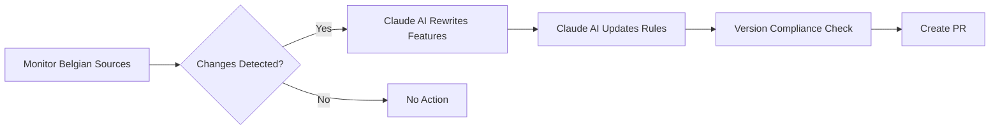

# Feature and Rules Versioning System

## Overview

The PAA project implements a **hybrid versioning strategy** where legal components (Features + Rules) are synchronized while technical components (Types + State Machines) maintain independent versioning.

This ensures that:
- **Legal changes** are traceable and auditable
- **Technical improvements** can be made without creating fake "legal version" changes
- All components can be verified for compatibility

## Version Dependency Flow

```
LAW CHANGES (v2024.1 → v2024.2)
     ↓
Features (Gherkin specification) - UPDATED FIRST
     ↓
     ├──→ Rules (json-rules-engine) - MUST BE REGENERATED
     ├──→ Types (TypeScript) - MIGHT need changes
     └──→ State Machines (XState) - MIGHT need changes
```

## Version Types

### Legal Version (Synchronized)

**Features + Rules** share the same version because:
- Features specify **WHAT** the law requires (business requirements)
- Rules implement **WHAT** the law requires (executable logic)
- Both change together when legislation changes

**Format**: `YEAR.MINOR.PATCH` (e.g., `2024.1.0`, `2025.1.0`)

### Technical Version (Independent)

**Types + State Machines** have independent versions because:
- They evolve for technical reasons (refactoring, optimization)
- A state machine refactor doesn't mean the law changed
- Types can be reused across multiple legal versions

**Format**: Semantic versioning `MAJOR.MINOR.PATCH` (e.g., `1.3.0`, `3.0.0`)

## Component Versioning

### 1. Features (Gherkin Specifications)

**Location**: `features/benefits/`

**Metadata Format**:
```gherkin
# language: fr
# @specification-version:2024.1.0
# @effective-date:2024-01-01
# @legal-basis:Loi du 26 mai 2002 concernant le droit à l'intégration sociale
# @legal-url:https://www.ejustice.just.fgov.be/...
# @implemented-by:src/rules/risRules.ts

Fonctionnalité: Revenu d'Intégration Sociale (RIS)
  Version: 2024.1.0
  ...
```

**When to bump version**:
- Legal amounts change (indexation)
- Eligibility criteria change
- New conditions added/removed
- Calculation formulas change

### 2. Rules (json-rules-engine)

**Location**: `src/rules/`

**Metadata Format**:
```typescript
export const RIS_RULES_METADATA = {
  implementsSpecification: '2024.1.0',  // MUST match feature version
  implementationVersion: '2024.1.0',
  implementationStatus: 'complete',     // 'complete' | 'partial' | 'outdated'
  lastSyncedWith: 'features/benefits/ris.feature',
  generatedFrom: 'features/benefits/ris.feature@2024.1.0',
  divergences: [],                      // Any known differences
  effectiveDate: '2024-01-01',
};
```

**When to bump version**:
- ALWAYS when the feature version changes
- Rules MUST implement the same version as their feature

### 3. Types (TypeScript)

**Location**: `src/domain/`

**Metadata Format**:
```typescript
export const RIS_TYPES_METADATA = {
  schemaVersion: '3.0.0',                        // Independent technical version
  compatibleWithSpec: ['2024.1.0', '2024.2.0'],  // Can support multiple legal versions
  requiredBy: 'RIS_RULES_v2024.2.0'
};
```

**When to bump version**:
- MAJOR: Breaking changes to data structure
- MINOR: New optional fields added
- PATCH: Documentation or metadata updates

### 4. State Machines (XState)

**Location**: `src/workflows/`

**Metadata Format**:
```typescript
export const RIS_WORKFLOW_METADATA = {
  workflowVersion: '1.3.0',                     // Independent workflow version
  compatibleWithRules: ['2024.1.0', '2024.2.0'], // Compatible legal versions
  minTypesVersion: '3.0.0'                      // Minimum types version required
};
```

**When to bump version**:
- MAJOR: Workflow structure changes (states added/removed)
- MINOR: New features (retry logic, validation improvements)
- PATCH: Bug fixes, optimizations

## Version Compliance Checking

### Check All Benefits
```bash
npm run check:versions
```

### Check Specific Benefit
```bash
npm run check:versions -- ris
npm run check:versions -- agr
```

### Strict Mode (CI/CD)
```bash
npm run check:versions:strict
```
Exits with error code 1 if any component is non-compliant.

### Example Output

```
✅ RIS - COMPLIANT
   Specification Version: 2024.1.0

   Components:
   ✓ Feature: v2024.1.0
   ✓ Rules: v2024.1.0 (synced)
   ✓ Types: v3.0.0 (compatible)
   ✓ Workflow: v1.3.0 (compatible)
```

## Version Change Scenarios

### Scenario 1: Legal Indexation (Amounts Change)

```
Legislation updates → RIS amounts increase by 2%

Changes Required:
✅ Features: v2024.1 → v2024.2 (update amounts in scenarios)
✅ Rules: v2024.1 → v2024.2 (update RIS_AMOUNTS_2024)
⚠️  Types: Add '2024.2.0' to compatibleWithSpec
⚠️  State Machines: Add '2024.2.0' to compatibleWithRules
```

**Steps**:
1. Update feature file with new version and amounts
2. Update rules file with new version and amounts
3. Update types compatibility list (if needed)
4. Update workflow compatibility list (if needed)
5. Run `npm run check:versions` to verify

### Scenario 2: New Eligibility Condition

```
Law adds new condition: "must be unemployed for 6 months"

Changes Required:
✅ Features: v2024.2 → v2025.1 (add new scenario)
✅ Rules: v2024.2 → v2025.1 (add new condition)
✅ Types: v3.0.0 → v4.0.0 (add new field: unemploymentDurationMonths)
✅ State Machines: v1.3.0 → v2.0.0 (add validation state)
```

### Scenario 3: Workflow Optimization (No Legal Change)

```
Add retry logic to state machine

Changes Required:
❌ Features: No change (law didn't change)
❌ Rules: No change (calculation logic same)
❌ Types: No change
✅ State Machines: v1.3 → v1.4 (technical improvement)
```

## Compliance Status Meanings

| Status | Meaning | Action Required |
|--------|---------|-----------------|
| **Compliant** | All components in sync | None |
| **Needs Update** | Minor version mismatch | Update outdated components |
| **Critical** | Rules not found or major mismatch | Urgent: Implement missing rules |
| **Error** | Feature file not found | Create feature specification |

## Best Practices

### 1. Always Update Features First
The feature file is the **source of truth**. When law changes:
1. Update the feature file with new version
2. Update scenarios/amounts
3. Then update rules to match

### 2. Keep Rules in Sync
Rules **MUST** implement the same version as their feature:
```typescript
// ✅ CORRECT
Feature: @specification-version:2024.1.0
Rules:   implementsSpecification: '2024.1.0'

// ❌ WRONG
Feature: @specification-version:2024.2.0
Rules:   implementsSpecification: '2024.1.0'  // OUTDATED!
```

### 3. Use Compatibility Lists
Types and workflows don't need exact version matches, but should declare compatibility:
```typescript
// Types can support multiple legal versions
compatibleWithSpec: ['2024.1.0', '2024.2.0', '2024.3.0']

// Workflows declare which rules they work with
compatibleWithRules: ['2024.1.0', '2024.2.0']
```

### 4. Run Compliance Checks in CI/CD
Add to your CI pipeline:
```yaml
- name: Check Version Compliance
  run: npm run check:versions:strict
```

### 5. Document Changes
Use the `@change-reason` metadata:
```gherkin
# @specification-version:2024.2.0
# @change-reason:Indexation semestrielle - montants augmentés de 2%
```

## Benefit ID Aliases

Some benefits have different IDs than their feature file names:

| Benefit ID | Feature File | Rules File |
|------------|--------------|------------|
| `ris` | `ris.feature` | `risRules.ts` |
| `agr` | `income-guarantee.feature` | `agrRules.ts` |

The version compliance checker handles these aliases automatically.

## Troubleshooting

### "Rules version outdated"
```bash
# Update the rules file to match feature version
# Edit src/rules/risRules.ts
export const RIS_RULES_METADATA = {
  implementsSpecification: '2024.2.0',  // ← Update this
  implementationVersion: '2024.2.0',     // ← And this
  ...
};
```

### "Feature file not found"
```bash
# Ensure feature file exists in correct location
ls features/benefits/*.feature

# Check if benefit needs an alias in src/utils/versionCompliance.ts
```

### "Types not compatible"
```typescript
// Add the new version to compatibility list
export const RIS_TYPES_METADATA = {
  schemaVersion: '3.0.0',
  compatibleWithSpec: ['2024.1.0', '2024.2.0'],  // ← Add new version
};
```

## Automated Monitoring & Updates 🤖

The PAA system includes **fully automated legal source monitoring** with **AI-powered updates** using Claude.

### How It Works



### Weekly Monitoring

Every Monday at 9:00 AM (UTC), GitHub Actions automatically:

1. **Scans Belgian legal sources**:
   - SPF Intégration Sociale (RIS)
   - ONEM (AGR, unemployment)
   - SPF Sécurité Sociale (GRAPA)
   - ejustice.just.fgov.be (legal texts)

2. **Detects changes**:
   - Amount indexation
   - New legal texts
   - Modified articles
   - Effective date changes

3. **Uses Claude AI** to rewrite (if `ANTHROPIC_API_KEY` is set):
   - Features files with new versions and amounts
   - Rules files to match specifications
   - Maintains legal accuracy and version compliance

4. **Creates Pull Request**:
   - With detailed change report
   - Version bumped correctly
   - Ready for human review

### Commands

#### Monitor Legal Sources

```bash
# Run monitoring scan
npm run monitor:legal

# Show monitoring state (tracked amounts, history)
npm run monitor:legal:state
```

#### Automated Updates with AI

```bash
# Full automation (monitor → AI rewrite → commit → PR)
npm run auto-update

# Preview changes without committing
npm run auto-update:dry-run

# Monitor and update manually (no AI)
npm run monitor:legal
# Review changes, then update files manually
```

### Configuration

#### GitHub Secrets

Set these in your repository settings:

```
ANTHROPIC_API_KEY = sk-ant-api03-...
```

Without this secret, the system will:
- ✅ Still monitor legal sources
- ✅ Create GitHub issues when changes detected
- ❌ NOT automatically rewrite features/rules

#### Environment Variables

```bash
# Local development
export ANTHROPIC_API_KEY="sk-ant-api03-..."
export CLAUDE_MODEL="claude-3-5-sonnet-20241022"

# Run automated update
npm run auto-update
```

### Workflow Example

**Scenario: RIS amounts increase by 2% (indexation)**

1. **Monday 9:00 AM**: GitHub Action runs
2. **Monitor**: Detects new amounts on SPF website
3. **AI Rewrite**:
   - Feature file: Updates amounts, bumps version to 2024.2.0
   - Rules file: Updates `RIS_AMOUNTS_2024`, bumps version to 2024.2.0
4. **Compliance**: Runs `npm run check:versions` → ✅ Compliant
5. **PR Created**: `[Auto-Update] Legal changes detected - 2024-07-15`
6. **Human Review**: Legal expert reviews and approves
7. **Merge**: Changes go live

### Monitoring State

The system maintains state in `.monitoring-state.json`:

```json
{
  "lastScanDate": "2024-11-17T09:00:00.000Z",
  "knownAmounts": {
    "ris": {
      "isolé": 1229.12,
      "cohabitant": 819.41,
      "familleMonoparentale": 1638.82
    }
  },
  "scanHistory": [...]
}
```

This enables:
- Change detection (compare current vs known amounts)
- Scan history tracking
- Confidence scoring

### Safety Features

1. **Human Review Required**:
   - All AI changes go through PR review
   - Never auto-merges
   - Compliance checks must pass

2. **Confidence Scoring**:
   - AI results rated: high/medium/low
   - Low confidence = requires manual review flag

3. **Validation**:
   - Gherkin syntax validation
   - TypeScript type checking
   - Version compliance verification

4. **Dry-Run Mode**:
   - Preview changes before committing
   - Test automation locally

### Customization

#### Add New Benefits to Monitor

Edit `src/utils/legalSourceMonitor.ts`:

```typescript
const LEGAL_SOURCES = {
  // ... existing
  grapa: {
    sourceId: 'grapa-spf',
    sourceName: 'SPF Sécurité Sociale - GRAPA',
    sourceUrl: 'https://www.socialsecurity.belgium.be/...',
    checkInterval: 'monthly',
  },
};
```

#### Customize AI Prompts

Edit `src/ai/claudeIntegration.ts`:

- `generateFeatureRewritePrompt()` - Feature file updates
- `generateRulesRewritePrompt()` - Rules file updates

#### Change Schedule

Edit `.github/workflows/legal-source-monitoring.yml`:

```yaml
on:
  schedule:
    - cron: '0 9 * * 1'  # Every Monday at 9 AM
    # Change to: '0 9 1 * *' for monthly (1st of month)
```

### Limitations & Future Work

**Current Limitations**:
- Web scraping placeholders (needs implementation for actual source parsing)
- Only monitors predefined sources
- Requires GitHub CLI (`gh`) for PR creation

**Planned Enhancements**:
1. Real web scraping implementation (Cheerio/Playwright)
2. Multi-language support (FR/NL/DE) for legal sources
3. Email notifications for detected changes
4. Automatic test generation for new scenarios

## Future Enhancements

### Planned Features

1. **Version Migration Tool**
   ```bash
   npm run migrate:version -- --benefit=ris --from=2024.1.0 --to=2024.2.0
   # Shows diff
   # Updates all components
   # Runs compliance check
   ```

2. **Legal Changelog Generator**
   ```bash
   npm run changelog:legal
   # Generates LEGAL_CHANGELOG.md
   # Lists all version changes with dates and reasons
   ```

## Related Documentation

- [CLAUDE.md](../CLAUDE.md) - Main project documentation
- [Hybrid Architecture](../CLAUDE.md#hybrid-architecture) - Why we use this approach
- [Legal Metadata](../src/domain/legalMetadata.ts) - Legal reference tracking
