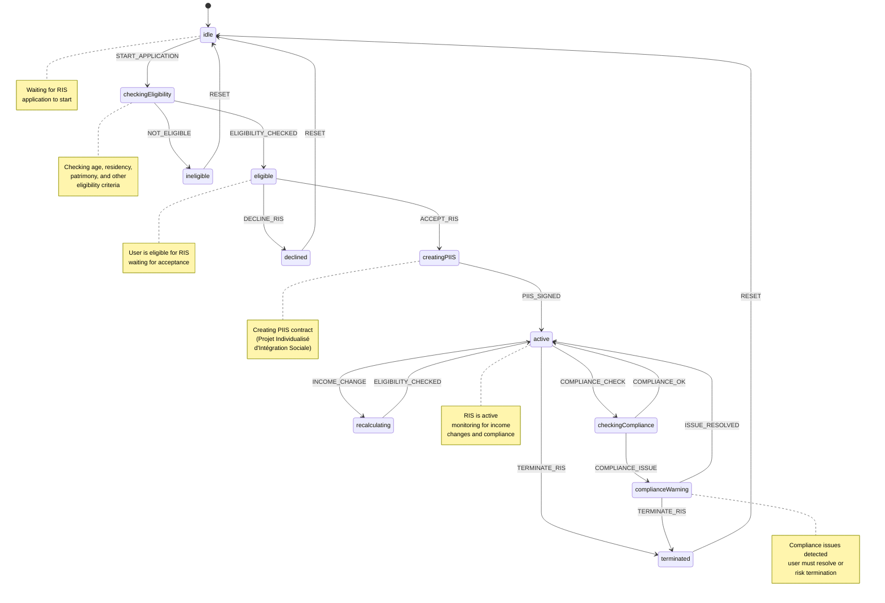
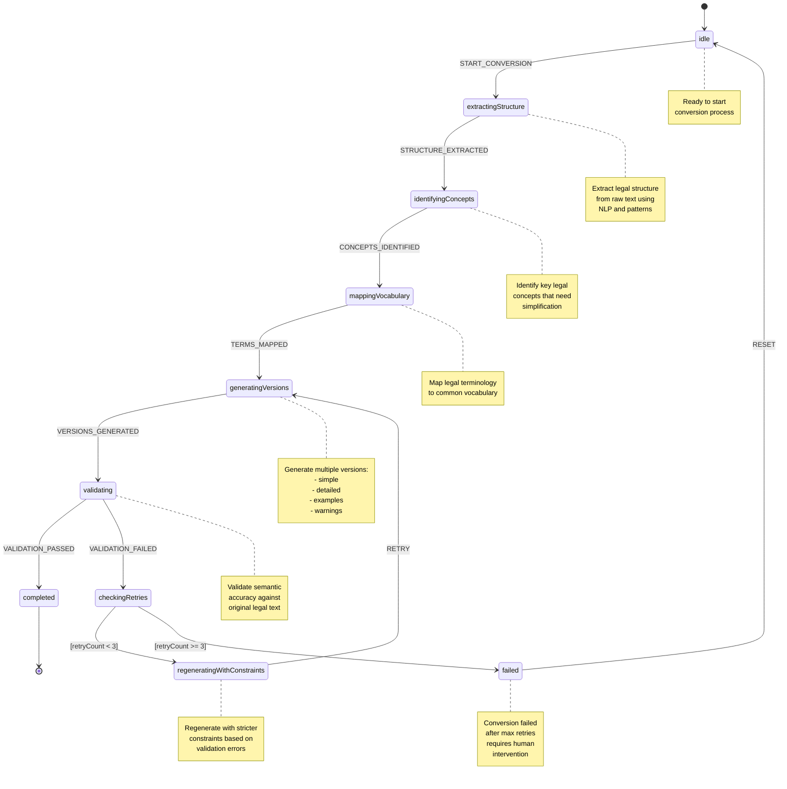

# State Machine Visualizations

## 1. RIS Application Workflow State Machine

### RIS State Machine Details

**States (11 total):**
- `idle` - Waiting for application start
- `checkingEligibility` - Evaluating age, residency, patrimony, and eligibility criteria
- `eligible` - User meets all criteria, awaiting acceptance decision
- `ineligible` - User doesn't meet criteria
- `declined` - User rejected the RIS offer
- `creatingPIIS` - Creating PIIS (Projet Individualisé d'Intégration Sociale) contract
- `active` - RIS is active and being received
- `recalculating` - Recalculating RIS amount due to income changes
- `checkingCompliance` - Verifying PIIS obligations and residency requirements
- `complianceWarning` - Compliance issues detected
- `terminated` - RIS has been terminated

**Events:**
- `START_APPLICATION` - Start the RIS application process
- `ELIGIBILITY_CHECKED` - Eligibility check completed
- `ACCEPT_RIS` - User accepts RIS offer
- `DECLINE_RIS` - User declines RIS offer
- `PIIS_SIGNED` - PIIS contract signed
- `INCOME_CHANGE` - User's income has changed
- `COMPLIANCE_CHECK` - Periodic compliance check
- `COMPLIANCE_OK` - Compliance check passed
- `COMPLIANCE_ISSUE` - Compliance issues found
- `ISSUE_RESOLVED` - Compliance issues resolved
- `TERMINATE_RIS` - Terminate RIS benefits
- `RESET` - Reset to initial state

---

## 2. Legal Text Conversion Pipeline State Machine

### Conversion Pipeline State Machine Details

**States (8 total):**
- `idle` - Ready to start conversion
- `extractingStructure` - Extract legal structure from raw text using NLP
- `identifyingConcepts` - Identify key legal concepts needing simplification
- `mappingVocabulary` - Map legal terminology to common vocabulary
- `generatingVersions` - Generate multiple versions (simple, detailed, examples, warnings) using LLM
- `validating` - Validate semantic accuracy against original legal text
- `checkingRetries` - Determine if retry is needed (max 3 attempts)
- `regeneratingWithConstraints` - Regenerate with stricter constraints based on validation errors
- `completed` - Final state - conversion succeeded
- `failed` - Final state - conversion failed after max retries

**Events:**
- `START_CONVERSION` - Start the conversion process
- `STRUCTURE_EXTRACTED` - Legal structure has been extracted
- `CONCEPTS_IDENTIFIED` - Key concepts have been identified
- `TERMS_MAPPED` - Legal terms mapped to common vocabulary
- `VERSIONS_GENERATED` - Multiple versions have been generated
- `VALIDATION_PASSED` - Semantic validation passed
- `VALIDATION_FAILED` - Semantic validation failed
- `RETRY` - Retry generation with constraints
- `MAX_RETRIES_REACHED` - Maximum retry attempts reached
- `RESET` - Reset to initial state

**Context:**
- `legalText` - Source legal text to convert
- `targetLevel` - Target simplification level (simple, detailed, examples, warnings, optimizer)
- `targetAudience` - Target audience (general, cpas-beneficiary, social-worker, optimizer)
- `extractedStructure` - Extracted legal structure
- `identifiedConcepts` - Identified legal concepts
- `mappedTerms` - Mapped terminology
- `generatedVersions` - Generated simplified versions
- `validationErrors` - List of validation errors
- `retryCount` - Number of retry attempts (max 3)

---

## Implementation Files

- RIS Machine: `/src/workflows/risMachine.ts`
- Conversion Machine: `/src/workflows/conversionMachine.ts`
- RIS Types: `/src/domain/risTypes.ts`
- Conversion Types: `/src/domain/types.ts`
- RIS Examples: `/src/examples/risWorkflowExample.ts`, `/src/examples/risWorkflowSimple.ts`
- Conversion Example: `/src/examples/conversionExample.ts`

---

## Architecture Integration

Both state machines are part of the **Plateforme d'Aide Administrative (PAA)** system that aims to make Belgian social and legal systems more accessible:

1. **RIS Machine** - Manages the complete workflow for applying to RIS (Revenu d'Intégration Sociale - Social Integration Income) benefits
2. **Conversion Machine** - Transforms complex legal text into simplified, common language to make legal information accessible to everyone

These machines work together to provide:
- Automated eligibility checking
- Simplified legal explanations
- Workflow automation for social benefits
- Compliance monitoring
- Multi-level content generation for different audiences
